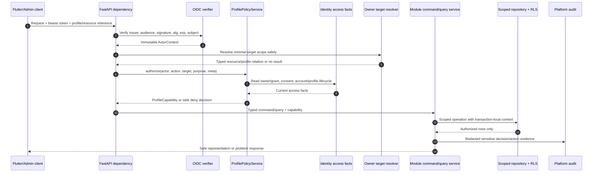
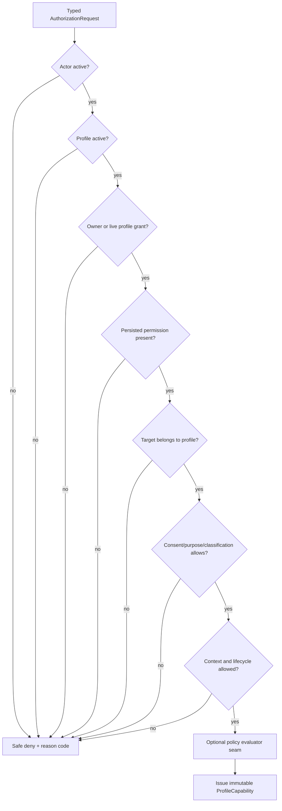
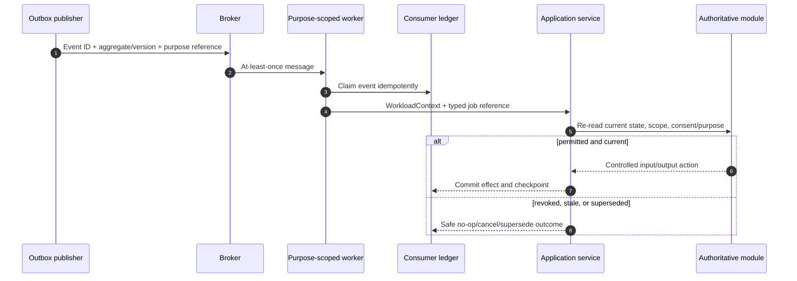

# Access Control Enforcement

## 1. Enforcement objective

Authorization in Nirog is a **server-side decision at every protected request and protected worker action**. The system must prove all of the following before returning or mutating health-context data: who is acting, whether the actor is currently active, whether the actor has a live relationship to the target profile, whether the requested permission is present, whether the exact resource belongs to that profile, whether consent/purpose and resource-class conditions permit the operation, and whether the module’s own state/version rules allow the action.

The implementation uses policy enforcement points at the API route, application service, scoped repository, private-object capability issuer, and worker service boundary. These are complementary controls. OIDC authenticates an account; the profile policy service determines authority; the resource owner proves scope; the repository filters to scope; PostgreSQL RLS limits rows; and private storage uses a short-lived, purpose-bound capability. No bearer token, role label, team membership, database role, signed asset URL, or background-job message may substitute for the complete decision.



## 2. Authentication creates an actor, not authority

The token verifier accepts only configured OIDC issuers, audiences, algorithms, and signing keys, then validates temporal claims and subject before mapping `(issuer, subject)` to `identity.auth_identities`. The result is an immutable `ActorContext` containing the local account identifier, verified issuer/subject, session identifier where available, safe device reference, authentication time, and correlation metadata. It does not contain raw token text, an unverified role claim, a client-selected profile, or a permanent permission list.

| Input | Processing rule | Output or outcome |
|---|---|---|
| Bearer token | Validate signature against an allowlisted algorithm/key and validate issuer, audience, expiry, `nbf` where used, and subject. | Valid token proceeds to local account resolution. |
| OIDC subject | Resolve unique local account mapping; check local account status. | Immutable `ActorContext` or an authentication failure. |
| Device identifier | Treat as an attested/registered device reference only after authenticated account association validation. | Optional context; never a profile authority principal. |
| Client `profileId` | Parse as a typed identifier, then treat it only as a requested scope. | Requires independent relationship and resource checks. |
| Client role/permission field | Ignore for authorization. | May be rejected as unexpected input or retained only in an auditable administrative command that itself is authorized. |

The verifier is centralized. Direct JWT decoding in a route, background task, WebSocket handler, CLI script, or storage adapter is prohibited. OWASP recommends validating issuer, audience, integrity, and lifetime claims for JWT-based access control; Nirog additionally keeps mutable health-resource authority out of token claims so revocation is effective on the next server evaluation.[1]

## 3. The typed authorization request and result

All authorization is expressed through one typed contract. The policy service does not accept ad hoc strings, an ORM object, a mutable dictionary, or a broad database session. It receives a resource reference carrying exactly the trusted target facts needed for the decision and returns an immutable result that cannot be reused for a different target or request.

```python
@dataclass(frozen=True)
class ResourceRef:
    kind: ResourceKind
    resource_id: UUID
    profile_id: ProfileId | None
    classification: ResourceClassification
    lifecycle: ResourceLifecycle
    owner_module: ModuleName

@dataclass(frozen=True)
class AuthorizationRequest:
    actor: ActorContext
    action: Permission
    resource: ResourceRef
    purpose: ConsentPurpose | None
    request_meta: RequestMeta

@dataclass(frozen=True)
class ProfileCapability:
    account_id: AccountId
    profile_id: ProfileId
    effective_permissions: frozenset[Permission]
    grant_id: GrantId | None
    grant_version: int | None
    consent_version: int | None
    policy_revision: str
    issued_for_request_id: CorrelationId
```

`ResourceRef` is produced by the resource-owning module. For a route nested under `/profiles/{profileId}/…`, the API first authorizes the profile action and then uses a scoped repository query that requires both the profile and resource ID. A result from another profile is indistinguishable from absence. For a legacy direct-ID route, a narrow resource-scope resolver may return only authorizing metadata for an actor who is already related to that profile; it never returns raw content or an unfiltered record. New APIs should prefer nested profile paths because they allow profile policy to run before resource loading.

| Route form | Enforcement pattern | Safe result when target is cross-profile |
|---|---|---|
| `/profiles/{profileId}/documents/{documentId}` | Evaluate profile capability; repository queries `WHERE profile_id = :profile AND id = :document`. | No record; external `404` where disclosure policy requires. |
| `/profiles/{profileId}/regimens/{regimenId}` | Evaluate `regimen.read`/write for path profile; load aggregate only inside same scope. | No record/`404`; audit denial internally. |
| `/documents/{documentId}` *(legacy/temporary)* | Use a minimal actor-scoped resolver to obtain only a relation-safe `ResourceRef`, then evaluate action and retrieve through scoped repository. | No resource detail; safe `404` or policy-defined denial. |
| Object download | Evaluate `document.read_image`, purpose/consent, document relation, device/session rules; mint capability after approval. | No URL, no storage key, no existence disclosure. |

## 4. Profile policy service

`ProfilePolicyService` is the single cross-module interpreter of profile authority. It composes facts but does not own them. Identity provides account lifecycle, owner/grant, permission snapshot, consent, and device facts. The resource owner provides target-to-profile relation, lifecycle, and classification. The request supplies an action and safe context. The service returns a denial unless every required predicate passes.



| Input fact | Canonical source | Why it must be current |
|---|---|---|
| Account status | `identity.accounts` | A valid but deactivated account must not retain access until token expiry. |
| Owner relationship | `identity.patient_profiles.owner_account_id` | Ownership is implicit and non-revocable through caregiver grant deletion. |
| Caregiver relationship | Live `identity.profile_access` row | Revocation/expiry changes access on the next evaluation. |
| Effective permission | Persisted grant `permission_set` and registry release | Template changes cannot silently broaden historic grants. |
| Consent/purpose | `identity.consents` and protected-operation configuration | Consent is a condition, not a direct database credential. |
| Resource scope | Resource owner’s relation query | Prevents object-ID substitution and BOLA. |
| Device/session context | Registered device/session fact where policy requires | A push endpoint or device ID is never enough by itself. |
| Policy revision | RBAC baseline/policy release value | The audit trail can explain the evaluated decision without recording raw inputs. |

An authorization result has no authority beyond the current command/query. It is not serialized to Flutter, put on a message queue, cached as a bearer object, or copied to another module’s table. If a request requires two profile-scoped resources, the handler must authorize and scope each relation; it must not assume permission for document A permits document B.

## 5. Policy-enforcement points

The application distributes enforcement across layers so a missed route check does not become a full data breach. Every layer has a distinct purpose; repeating the same `role == …` check is not defense in depth.

| Enforcement point | Required control | Failure behavior |
|---|---|---|
| Edge/API gateway | TLS, size/rate/cost limits, route allowlist, correlation ID. | Reject before app execution. |
| FastAPI dependency | Token → `ActorContext`; explicit action/resource authorization request. | `401` for authentication failure; safe authorization problem thereafter. |
| Application service | Capability bound to command; target relation, consent/purpose, state/version, business rules. | Typed denial, conflict, or validation error; no side effects. |
| Repository | Require profile/account scope in query methods; no unconstrained profile-table reads. | Empty result / domain absence; never a cross-scope row. |
| PostgreSQL RLS | Transaction-local actor/profile context and allow policy; application/worker roles lack `BYPASSRLS`. | Database returns no permitted row. |
| Object capability issuer | Short TTL, object/revision/purpose/action binding, private bucket. | No capability minted. |
| Worker service | Workload identity, job source/stage/purpose, re-read of current owner state. | Safe no-op, cancel/supersede, or controlled retry. |

OWASP recommends least privilege, deny-by-default, and permission validation on every request. It also notes that object-level and relationship-based decisions require more than a static role label.[2] Nirog therefore treats a permission match as one gate in the policy chain, never the final resource lookup condition.

## 6. PostgreSQL RLS and connection scope

RLS is defense in depth for profile-scoped tables. After authentication and authorization, the transaction sets `LOCAL app.account_id`, `LOCAL app.profile_id`, and a limited actor/workload principal marker before calling a scoped repository. RLS policies compare these values to profile ownership or a live grant; module queries still include explicit profile filters. The connection-pool lifecycle resets the context on checkout and return so a subsequent borrower cannot inherit a previous profile scope.

```sql
-- Illustrative; exact function names and policies are owned by migrations.
SELECT set_config('app.account_id', :account_id::text, true);
SELECT set_config('app.profile_id', :profile_id::text, true);

SELECT *
FROM prescription.documents
WHERE id = :document_id
  AND profile_id = :profile_id;
```

| Database principal | Permitted posture | Prohibited posture |
|---|---|---|
| API runtime role | Uses RLS, no table ownership, no `BYPASSRLS`, scoped transactions only. | Direct unrestricted table browsing or migration execution. |
| Worker runtime role | Uses RLS plus workload-purpose policy; limited schema privileges. | Reuse of API owner role or end-user database credentials. |
| Migration role | Separate, short-lived operational path; audited. | Serving API/worker requests. |
| Break/fix operator | Separately approved, time-bounded, audited path outside normal application code. | Ambient administrator account in the connection pool. |

PostgreSQL RLS defaults to deny when enabled with no applicable policy, but table owners and roles with `BYPASSRLS` require special handling. For this reason, Nirog never treats RLS as the primary authorization decision and keeps normal runtime principals separate from migration/owner roles.[3]

## 7. Sensitive-object access

Prescription images, OCR crops, raw extraction text, and provider payloads remain in private object storage. An API query may return evidence metadata when `document.read_metadata` is allowed; it may mint an object capability only when `document.read_image` plus the applicable consent/purpose and target conditions are allowed. The URL binds the exact object revision, action, expiry, and purpose where the storage system supports it, has a short lifetime, and is never logged, sent through a queue, or cached in a generic response store.

The storage layer is an enforcement component but is not the authority source. A valid signed URL cannot override later server policy; for high-risk flows, refreshing a capability performs a fresh policy evaluation. The stage worker obtains restricted evidence only through a service-authorized read after it has claimed a job, re-read the job state, and verified the current purpose and lifecycle.

## 8. Revocation, caching, and consistency

The default implementation reads live grant and consent state for protected actions. If optimization is needed, the cache stores only derived access facts keyed by account, profile, grant version, consent version, resource classification, action, and policy revision; it never stores a reusable `ProfileCapability` or signed object URL. A grant/consent/profile/account change publishes a transactional outbox event that invalidates affected access/read caches. High-risk document-image and mutation decisions bypass or use an extremely short-lived cache; the source of truth remains the current database state.

| Change | Required immediate behavior | Deferred behavior |
|---|---|---|
| Grant revoked/expired | New API requests deny; current command rechecks before commit. | Invalidate cache; worker rechecks before restricted read/output commit. |
| Consent withdrawn | New protected processing/disclosure denies. | Cancel/supersede permitted pending work according to retention rules. |
| Account/profile deactivated | Actor/profile lifecycle check denies. | Device/session/cache invalidation and asynchronous cleanup. |
| Permission registry/policy release | New requests evaluate the released policy configuration only after controlled publish. | Compatibility checks, trace comparison, monitored rollout. |

## 9. Worker and internal-process authorization

Workers are authenticated workload principals, not headless end users. Each task queue/purpose maps to a narrow `WorkloadContext` containing a workload identity, allowed module operations, source event/job type, stage/purpose, correlation/cause IDs, and bounded retry class. The worker must call a named application service that checks this context before any read or write. A raw queue message is untrusted transport data and cannot itself authorize an action.



An ML worker may create stage output in `prescription.*` only through its stage-specific service and with the permitted evidence/purpose boundary. It cannot create or activate `regimen.*` or `adherence.*` data. A user’s evidence-assisted confirmation or manual command must create regimen state, which protects the core clinical confirmation invariant.

## 10. Safe errors and verification

External errors identify the request correlation ID and a stable problem code, but they do not reveal whether a foreign profile/document/regimen exists, why a caregiver’s grant was revoked, raw policy predicates, internal table names, tokens, or stack traces. The audit record captures the internal reason category and safe target reference. The disclosure mapping is centrally documented so different modules do not accidentally return different answers for the same BOLA scenario.

| Test | Required assertion |
|---|---|
| Token validation | Wrong issuer, audience, algorithm, signature, expiry, or unknown subject fails before route logic. |
| BOLA | Every profile resource endpoint is tested with another profile’s UUID and never returns/mutates its data. |
| Direct-ID resolver | A direct-ID endpoint does not disclose cross-profile target existence through status, timing, body, or error field. |
| Permission split | Metadata permission cannot mint an image capability; read cannot invoke a write route. |
| Revocation | Revoke during a long-lived request/worker flow prevents the restricted read or output commit checkpoint. |
| RLS | Missing/mismatched/reset transaction context returns no protected rows under a reused connection. |
| Worker identity | A worker from one purpose cannot invoke another module’s privileged application service. |
| Audit | Sensitive allow/deny decisions record correlation, actor class, target reference, policy version, and no raw secret/health payload. |

## References

[1] [OWASP — REST Security Cheat Sheet](https://cheatsheetseries.owasp.org/cheatsheets/REST_Security_Cheat_Sheet.html)

[2] [OWASP — Authorization Cheat Sheet](https://cheatsheetseries.owasp.org/cheatsheets/Authorization_Cheat_Sheet.html)

[3] [PostgreSQL — Row Security Policies](https://www.postgresql.org/docs/current/ddl-rowsecurity.html)

[4] [OpenID Connect Core 1.0](https://openid.net/specs/openid-connect-core-1_0.html)

[5] [Nirog — Security, Privacy, and Governance Architecture](../system-architecture/08-security-privacy-and-governance-architecture.md)
