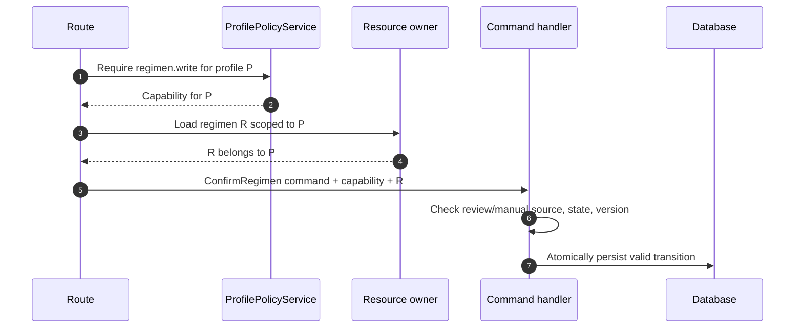

# Validation Architecture

## 1. Validation is a pipeline, not one schema check

Nirog treats validation as a sequence of distinct server-side gates. A request that is syntactically valid JSON can still be unauthenticated, unauthorized, cross-profile, outside consent, stale, clinically invalid, replayed, or inconsistent with database constraints. Every mutation must cross the complete pipeline before committing domain state; every protected query crosses the relevant read gates before materializing data.

The order is deliberate. It rejects malformed or oversized traffic before expensive work, establishes a verified actor before access evaluation, proves profile/resource scope before loading sensitive content, checks current state before a transition, and verifies replay/concurrency semantics before persistence. No Flutter validation, disabled UI control, navigation sequence, or locally cached permission can be treated as an enforcement gate. OWASP distinguishes syntactic validation from semantic/business validation and recommends server-side validation as early as possible; Nirog extends this with explicit authorization, lifecycle, and consistency gates.[1]

```mermaid
flowchart LR
  T[1 Transport and content] --> S[2 Strict schema]
  S --> A[3 Actor authentication]
  A --> P[4 RBAC permission]
  P --> R[5 Profile/resource relation]
  R --> C[6 Consent and purpose]
  C --> V[7 Aggregate state and version]
  V --> B[8 Domain business rules]
  B --> I[9 Idempotency]
  I --> D[10 Persistence constraints]
  D --> X[11 Atomic audit, outbox, response]
```



## 2. Fixed validation stages

The table below is the normative pipeline for commands. A query omits mutation-only stages such as idempotency and aggregate write-version comparison, but it never omits actor, authorization, relation, or safe-scoped retrieval. Each stage has one accountable owner and a safe failure category; modules must not move a check later merely because a UI or database constraint exists.

| Stage | Owner | Required checks | Safe outcome |
|---:|---|---|---|
| 1. Transport and content | Edge + API adapter | HTTPS, route/method allowlist, `Content-Type`, body/file size, encoding, multipart envelope, rate/cost control, correlation ID. | `400`, `405`, `413`, `415`, or `429`; no domain lookup. |
| 2. Strict schema | Pydantic/API adapter | Required/forbidden fields, strict types, enum values, UUID/date/timezone/decimal shape, range/length/count limits, no unexpected fields. | `400`/`422` safe validation problem; no actor/resource processing. |
| 3. Actor authentication | OIDC dependency | Issuer, audience, algorithm, signature, expiry, subject, local account lifecycle. | `401`; no target existence signal. |
| 4. RBAC permission | Access service | Requested action is registered and in the current owner/grant permission snapshot. | Safe deny; never fall through to a write. |
| 5. Profile/resource relation | Resource owner + access service | Actor’s approved profile scope matches the path and exact target belongs to that profile. | Safe `404` or policy-defined `403`; no cross-profile detail. |
| 6. Consent and purpose | Identity + protected-operation policy | Current consent/purpose, classification, sharing restriction, device/session condition where required. | Safe deny with no sensitive rationale. |
| 7. Aggregate state and version | Module application/domain layer | Lifecycle state, legal transition, source/review status, optimistic version/ETag, invariant prerequisites. | `409`/`412` or stable domain-state problem. |
| 8. Domain business rules | Module domain layer | Schedule, inventory, catalog-release, medication, invitation, delivery, or stage-specific semantic rules. | `422` or domain-specific safe problem. |
| 9. Idempotency | Platform application component | Key format, actor/profile/action binding, canonical request fingerprint, expiry/replay semantics. | Return the original safe result or `409` key-reuse conflict. |
| 10. Persistence constraints | Repository + PostgreSQL | Foreign keys, check/unique/exclusion constraints, RLS, transaction scope, atomic write conditions. | Map expected conflicts safely; unexpected failure is generic and logged. |
| 11. Atomic controls | Unit of work | Redacted audit, idempotency outcome, change record, and outbox event written with the owned state. | Roll back all business state on any required control-write failure. |

The access-service stages occur before a module loads sensitive body content. An idempotent retry is also re-authorized before the stored outcome is returned; a caller cannot reuse a previously observed idempotency key to learn or replay another actor’s result after revocation.

## 3. Transport and content validation

The API has a narrow content contract. JSON command routes consume `application/json` and publish `application/json` or `application/problem+json`. File-upload routes declare a specific multipart contract, maximum body/file size, accepted content types, and no arbitrary nested JSON/metadata blob. Unsupported method or media type is rejected before a module repository is called.

| Input class | Required validation | Additional Nirog rule |
|---|---|---|
| JSON command | Content type, bounded body, UTF-8, strict Pydantic model, `extra='forbid'`. | Do not silently accept renamed/deprecated write fields; version API contracts instead. |
| Path/query ID | UUID parser and route-specific ID type. | Do not convert a failed ID parse into a broader search or fallback lookup. |
| Date/time | ISO 8601 with offset or an explicit profile/device timezone policy. | Store `timestamptz`; never accept an ambiguous local dose time without resolution. |
| Numeric medication/schedule field | Decimal/integer strict type, finite/range/unit validation. | No binary float for dosage, quantity, or clinical calculation values. |
| Enum/set | Closed value registry and max collection size. | The client cannot invent a permission, schedule frequency, consent purpose, or stage state. |
| Free-form text | Unicode normalization policy, length bounds, context-specific character/format rules. | Preserve raw evidence separately; do not “sanitize” OCR text into clinical fact. |
| Prescription upload | Size/type allowlist, magic-byte/content decode verification, generated storage name, malware/image checks, private storage. | Filename, path, MIME declaration, EXIF, and client checksum are untrusted. |

Allowlist validation is the default. Denylists may detect known hostile patterns but never define the accepted domain shape. Pydantic coercion must be configured intentionally: sensitive commands use strict booleans/numbers/enums and reject extra fields; a compatibility endpoint that accepts a legacy representation maps it explicitly into the canonical command and emits a deprecation signal. OWASP advises strong type/range/format validation, body limits, expected content types, and server-side enforcement; the document-upload path additionally follows its private, non-loggable evidence boundary.[1] [2]

## 4. Schema-to-command pattern

Transport models and application commands are separate types. A Pydantic request model represents an untrusted wire contract; a command is a trusted, immutable application input created only after schema parsing, actor/capability resolution, and request metadata injection. Domain entities never receive raw request dictionaries.

```python
class RecordDoseRequest(BaseModel):
    model_config = ConfigDict(extra="forbid", strict=True)

    occurrence_id: UUID
    status: DoseStatus
    occurred_at: datetime
    note: Annotated[str | None, Field(max_length=500)] = None
    base_version: Annotated[int, Field(ge=1)]

@dataclass(frozen=True)
class RecordDoseCommand:
    capability: ProfileCapability
    occurrence_id: OccurrenceId
    status: DoseStatus
    occurred_at: datetime
    note: DoseNote | None
    base_version: AggregateVersion
    idempotency: IdempotencyMeta
    request_meta: RequestMeta
```

| Pattern | Required rule | Security/maintainability benefit |
|---|---|---|
| Request model | Strict and versioned; response-model fields are an allowlist. | Blocks mass-assignment and accidental internal-field exposure. |
| Mapper | Converts route schema to typed values exactly once. | Centralizes normalization and prevents raw-dict drift. |
| Command | Frozen and explicit; includes actor-derived metadata but not raw request/token. | The handler cannot be called with an authority-free mutable payload. |
| Domain value object | Validates stable domain concepts such as dose quantity, timezone, interval, or evidence source. | Rules are reusable outside HTTP, including worker/service paths. |
| Response read model | Deliberately shaped for the caller’s allowed view. | Metadata permission does not accidentally serialize image/storage fields. |

## 5. Authorization, relation, and consent are distinct gates

The permission gate answers “does this relationship have the named action?” The relation gate answers “is this exact resource part of the approved profile scope?” The consent/purpose gate answers “is this protected operation allowed now?” A positive result at one stage never implies a positive result at another.



This order prevents a caregiver with `regimen.write` for profile A from applying it to a guessed regimen ID in profile B. It also prevents an owner with a generic read baseline from receiving an image capability when the evidence-processing/share purpose has been withdrawn. The module owner is responsible for target relation and aggregate/state facts; Identity is responsible for owner/grant/consent facts; `ProfilePolicyService` composes them into the authorization decision.

## 6. State, version, and business validation

Authorization grants permission to **attempt** a transition; only the owning module may grant a valid transition. Each mutable aggregate has an explicit version. The caller supplies `If-Match` or `baseVersion`; the handler compares it while holding the necessary row/aggregate lock or via a conditional update. A conflict response contains a safe current-version/reload hint when permitted, not another profile’s state or a raw database error.

| Command family | State/version checks | Business checks before persistence |
|---|---|---|
| Profile grant/revoke | Grant state is live/pending as required; current grant/profile version. | Sharing consent, invitation expiry/identity, no prohibited delegation, one live grant. |
| Evidence upload/scan | Document/job lifecycle accepts request; upload token/session matches. | File manifest integrity, supported class, approved evidence purpose, release context. |
| Evidence review → regimen | Review decision is current and confirmable; target regimen base version. | User confirmation, candidate selection, catalog/release rules, no worker-created activation. |
| Manual regimen command | Regimen draft/current state and base version. | Dose/schedule fields, date bounds, interaction/inventory policy where available. |
| Planned occurrence/dose event | Occurrence belongs to profile and state accepts record/amendment. | Evidence timestamp bounds, event type, append/amendment rules; delivery receipt is not dose evidence. |
| Notification action | Intent/delivery/device state is current. | Preference, quiet-hour, device registration, deduplication and provider-safe payload. |
| Catalog release | Draft/review/release state and immutable release pointer version. | Curator/publisher separation, source/provenance/checksum, successor correction semantics. |

The backend enforces workflow order even when each individual endpoint is authenticated and permission-checked. For example, a direct “activate regimen” call cannot bypass evidence review and user confirmation, and a direct “complete scan stage” call cannot bypass source-stage prerequisites. OWASP identifies out-of-order API execution as a business-logic control risk and recommends server-side state-transition validation.[2]

## 7. Idempotency and persistence validation

All mutations require `Idempotency-Key`. The platform component validates key syntax/length, computes a canonical request fingerprint from the command’s safe semantic inputs, and binds the record to the actor, profile scope where applicable, action, endpoint/command version, and idempotency expiry. It checks only after the caller is freshly authenticated and authorized. A matching completed record returns the original status/body only if its binding matches; a key reused with a different fingerprint or scope receives a safe conflict. An in-progress record uses controlled wait/retry semantics rather than executing duplicate effects.

The database is the final integrity layer, not the sole validator. Repositories translate expected unique, foreign-key, check, exclusion, serialization, and RLS failures into known application outcomes only when they are safe and understood. Any unexpected persistence exception rolls back the full unit of work, emits redacted diagnostics, and becomes a generic server problem; it never returns raw SQL, table/constraint names, stack trace, or data values.

| Constraint class | Examples | Application behavior |
|---|---|---|
| Primary/foreign key | Grant points to a profile/account; dose event points to occurrence. | Validate presence/scope before write; map known stale deletion safely. |
| Check constraint | Time window order, positive quantity, valid JSON shape, lifecycle field compatibility. | Mirror semantically in domain value object; log unexpected divergence. |
| Partial unique index | One live profile grant; one active invitation; one idempotency binding. | Treat duplicate as replay/conflict, not a generic `500`. |
| Exclusion/unique schedule constraint | No illegal duplicate occurrence policy or overlapping protected interval where domain requires. | Return a business conflict with reload path. |
| Conditional version update | `WHERE id = … AND version = …`. | Return `409`/`412`; never overwrite silently. |
| RLS policy | Actor/profile context mismatch. | Treat as no authorized row; record safe access diagnostic. |

## 8. Error and disclosure contract

The API publishes `application/problem+json` with a stable `type`, machine-readable `code`, human-safe `title`, optional safe field pointers, `status`, and `correlationId`. Error details describe what the caller may correct without revealing authorization logic, resource existence outside scope, PII/health data, raw provider output, secrets, or database internals.

| Status | Use | Safe public content |
|---:|---|---|
| `400` | Malformed envelope, invalid header/key syntax. | Generic invalid request and correlation ID. |
| `401` | Missing/invalid/expired authentication. | Re-authentication guidance; no target detail. |
| `403` | Authenticated caller is known to be denied without existence sensitivity. | Generic prohibited action code. |
| `404` | Resource absent **or** inaccessible where existence must not be disclosed. | Generic not-found code only. |
| `409` | Idempotency key reused differently, duplicate invariant, state conflict. | Safe conflict/retry/reload guidance. |
| `412` | `If-Match`/base-version precondition failed. | Current version/reload cue only if caller may read it. |
| `413`/`415`/`422` | Size/media/schema/domain validation failure. | Safe field/range/contract issue; no internal parser details. |
| `429` | Rate/cost limit. | Retry guidance without revealing enforcement thresholds. |
| `500`/`503` | Unhandled/internal or unavailable dependency. | Correlation ID and safe retry statement; no stack trace. |

The platform audit record captures the internal decision reason category, but only sanitized values and target references. Repeated schema, actor, authorization, or state failures are a security/operational signal, not a reason to add sensitive request bodies to logs.

## 9. Validation test programme

Validation logic is executable architecture and must receive direct tests. Unit tests exercise value objects and domain rules. API contract tests submit malformed, missing, unexpected, boundary, and coercion-prone inputs. Authorization tests substitute IDs across profiles. Integration tests prove RLS and database constraints under connection reuse. Property-based tests generate valid/invalid schedules and state sequences; fuzz tests target parsers, file envelopes, and text normalization within safe non-production fixtures.

| Test family | Required proof |
|---|---|
| Transport/schema | Unknown fields, wrong media, oversized body, invalid UUID/timezone/enum, coercion, duplicate collection member, and invalid UTF-8 are rejected without persistence. |
| Auth/access | An untrusted role/permission field changes no decision; every permission/relationship/consent permutation gives the expected safe status. |
| Object scope | Replacing a nested/document/regimen/occurrence UUID never leaks another profile’s state. |
| State/version | Every illegal state edge, stale `If-Match`, stale review, or outdated release is rejected without side effects. |
| Idempotency | Same key/same command returns same committed receipt; same key/different actor/profile/action/body conflicts; revoked caller cannot retrieve old outcome. |
| Database | Constraint/RLS violations do not produce a partial audit/outbox/business write or raw storage error. |
| Worker | Duplicate/out-of-order message, revoked purpose, expired capability, and stale stage/release produce safe no-op/recovery behavior. |

## References

[1] [OWASP — Input Validation Cheat Sheet](https://cheatsheetseries.owasp.org/cheatsheets/Input_Validation_Cheat_Sheet.html)

[2] [OWASP — REST Security Cheat Sheet](https://cheatsheetseries.owasp.org/cheatsheets/REST_Security_Cheat_Sheet.html)

[3] [OWASP — Authorization Cheat Sheet](https://cheatsheetseries.owasp.org/cheatsheets/Authorization_Cheat_Sheet.html)

[4] [Nirog — Access Control Enforcement](02-access-control-enforcement.md)

[5] [Nirog — Module, Code, and Command Architecture](../system-architecture/03-module-code-and-command-architecture.md)
