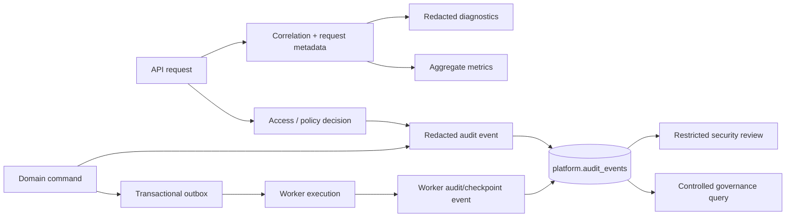
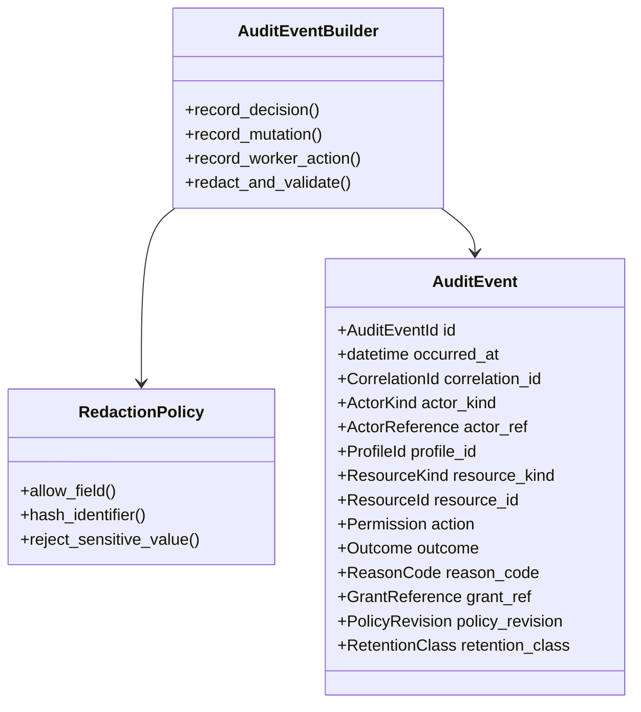
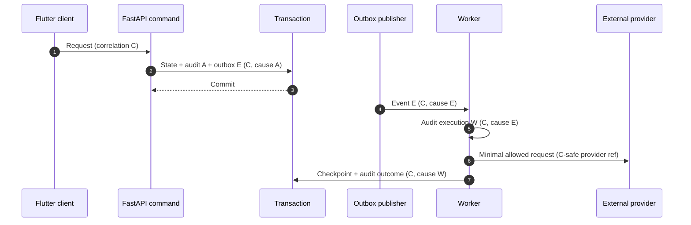

# Audit and Observability Architecture

## 1. Purpose and boundary

Nirog records enough evidence to answer **who attempted or performed which sensitive action, on what scoped target, through which authorized path, under which grant/consent/policy version, and with what safe outcome**. Audit data is not a general application log, not a substitute for an immutable domain history, and not a warehouse for raw health content. It supports security review, incident investigation, consent/grant traceability, operational recovery, and controlled governance without duplicating prescription images, OCR text, regimen notes, tokens, or provider payloads.

The Platform module owns the canonical append-oriented `platform.audit_events` record. Domain modules retain their own business history—such as regimen versions, review decisions, dose-event append history, and catalog release provenance—because audit evidence explains an action while domain records explain the clinical or business state. Audit creation is required inside the same transaction as sensitive mutations; a state change that cannot write its required audit evidence does not commit.

## 2. Audit-event model

Every audit event is an immutable, redacted description of a decision or effect. The record uses opaque internal identifiers and controlled vocabulary codes. It contains no raw authorization header, provider credential, signed object URL, password, unrestricted IP address where local privacy policy requires minimization, request/response body, free-form health note, OCR text, prescription image, or raw ML/provider output.

| Field family | Suggested fields | Rule |
|---|---|---|
| Identity and time | `id`, `occurred_at`, `recorded_at`, `event_version`, `environment`. | Generated server-side; clock source is controlled. |
| Correlation | `correlation_id`, `causation_id`, `request_id`, `trace_id`, `command_id`, `idempotency_key_hash`. | Link a request to downstream work without recording raw secrets. |
| Actor | `actor_kind`, `actor_account_id`, `workload_id`, `operator_session_ref`, `device_id` where relevant. | Store an authorized internal reference; never token/credential material. |
| Target | `profile_id`, `resource_kind`, `resource_id`, `aggregate_version`, `target_classification`. | Use minimal identifiers; do not copy the target payload. |
| Decision | `action`, `outcome`, `reason_code`, `http_status_class`, `disclosure_mode`. | Stable, reviewed enums; public error message is not duplicated as arbitrary text. |
| Access basis | `grant_id`, `grant_version`, `permission_snapshot_hash`, `consent_id`, `consent_version`, `purpose`, `policy_revision`. | Enables later explanation without copying full policy inputs or permission JSON. |
| Change reference | `before_version`, `after_version`, `event_type`, `outbox_event_id`, `job_id`, `stage_run_id`. | Reference owner history instead of serializing health/state content. |
| Integrity and retention | `schema_version`, `retention_class`, `integrity_reference`, `redaction_profile`. | Supports controlled evolution, retention, and evidence checks. |

`platform.audit_events` can contain a bounded `details` JSONB document only for a review-approved allowlist of non-sensitive codes, counts, state names, and hashes. It must reject arbitrarily nested request copies. Event serialization occurs through a typed `AuditEventBuilder`, not by passing a logger dictionary or ORM object to a generic JSON serializer.

## 3. Required audit coverage

Audit coverage is risk-based. The system records all access-administration changes and all actions that read restricted evidence, alter health-context state, invoke restricted processing, export/share data, or change an access/policy boundary. Routine low-risk reads can be sampled or aggregated only after an explicit privacy and operational decision; denials, anomalies, and sensitive-data access are never silently discarded.

| Event family | Mandatory events | Minimum outcome evidence |
|---|---|---|
| Authentication/session | Token validation failure classes, local account state denial, privileged session establishment/termination. | Actor reference when known, issuer/client class, safe failure code, correlation. |
| Profile access | Grant create/amend/reduce/revoke/expire, invitation acceptance/cancellation, owner transfer proposal/confirmation if later introduced. | Grant/template/permission-snapshot references, grantor, recipient, profile, consent condition, outcome. |
| Consent | Grant, withdraw, expire, supersede, purpose/scope/version change. | Profile, consent revision/purpose/scope code, actor, outcome; no free-text health context. |
| Authorization decision | Denied protected action; allowed raw-evidence access; sensitive export/share; privileged catalog/platform operation. | Action/target class, safe reason, policy/grant/consent references, disclosure mode. |
| Health-state mutation | Regimen creation/change/stop, review confirmation, dose event amendment, notification preference that affects health messaging. | Owner aggregate/version, source kind, actor/capability reference, outcome. |
| Evidence/ML | Upload manifest accepted/rejected, restricted asset capability issued, stage start/finish/fail, provider egress approval, review decision. | Document/job/stage release IDs, purpose/classification, workload, result category; no raw evidence/output. |
| Catalog/governance | Catalog release, correction successor, policy/permission registry/template publish/retire, retention hold/recovery operation. | Artifact revision/checksum, approving actor/process, rollout state, outcome. |
| Worker/recovery | Consumer claim, retry/dead-letter/recovery, cancellation/supersession after revocation, controlled compensation. | Event/job ID, workload, source version, retry class, current-state result. |

Sensitive “allow” records are important: an audit log that records only denials cannot prove that a prescription image, export, or grant was accessed under a valid policy. Conversely, audit volume must not become a reason to log raw bodies or high-cardinality sensitive labels; metrics are the appropriate source for aggregate throughput and latency.

## 4. Decision evidence and explanation

Every authorization decision produces an internal `AuthorizationDecision` with a stable `reason_code`, `policy_revision`, and optional references to the effective grant/consent. Only a subset becomes a durable audit event according to the coverage table; however, every sensitive allow/deny and every access-administration operation is durable. The reason vocabulary is intentionally coarse enough to be safe but specific enough for operator investigation.

| Internal reason code | Meaning | Public disclosure guidance |
|---|---|---|
| `actor_inactive` | Local account is not active. | Generic authorization/session problem. |
| `profile_inactive` | Profile is archived/deactivated. | Generic unavailable/not-found according to caller relation. |
| `no_live_profile_relation` | No owner relationship or live caregiver grant. | Do not disclose target existence. |
| `permission_missing` | Current snapshot lacks the requested action. | Generic prohibited action if target may be known; otherwise safe not-found. |
| `target_out_of_scope` | Resource does not belong to approved profile/scope. | Safe not-found in normal profile data flows. |
| `purpose_not_permitted` | Consent/purpose/classification condition fails. | Generic unavailable/prohibited; do not expose consent detail. |
| `state_not_permitted` | Lifecycle or workflow transition is invalid. | Safe conflict/state code where target is already visible. |
| `policy_unavailable` | Required evaluator/configuration is unhealthy. | Safe temporary failure or deny according to action risk; no rule trace. |
| `workload_not_permitted` | Worker identity/purpose cannot invoke operation. | Internal worker failure; no user-facing detail. |

Human users receive a clear but non-leaking correction path. Operators with the audited review permission may see the stable reason code and authorized references, but not the full policy expression or another profile’s data. This separation prevents the audit console from becoming a bypass path around the product’s data-classification controls.

## 5. Correlation across API, outbox, and workers

The API obtains or generates one correlation ID at the edge. A command receives it as immutable request metadata. When the command writes an outbox event, the event records the same correlation ID and a causation ID pointing to the command/audit event. A worker creates a new execution/span reference while retaining the original correlation and source event IDs. This gives investigators a bounded chain from mobile request to committed state, emitted event, consumer attempt, external adapter call, and recovery result.

The correlation contract must not insert raw bearer tokens, prescription IDs in external provider diagnostics, or direct client IP/user-agent strings into every event. If a network/device attribute is needed for anomaly review, store a minimized or keyed-hash representation under an approved retention class, and document the rotation/re-identification process.

## 6. Redaction, logging, and telemetry controls

Logs, traces, metrics, and audits have different roles and retention needs. A logger is not allowed to receive request objects, Pydantic model dumps for protected commands, database rows, exception representations containing bound parameter values, object URLs, or third-party SDK debug payloads. Structured log schemas use explicit fields and central filters reject/replace known secret and health-data keys. Provider SDK debug logging is disabled on restricted paths.

| Signal | Permitted data | Prohibited data | Access posture |
|---|---|---|---|
| Audit event | Stable IDs/references, action/outcome, revision/hash, safe reason. | Raw body, token, image, OCR text, free-form note, signed URL, secret. | Restricted platform/governance review. |
| Application log | Correlation, module, command name, timing, error class, safe count. | Request/response dump, SQL values, health payload, credentials. | Engineering operational access, retention-controlled. |
| Trace span | Operation names, duration, retry status, dependency class. | Raw target content, headers, URL query secrets, sensitive provider response. | Restricted observability access. |
| Metric | Aggregated counts/durations/queue age; bounded labels. | Profile/account/document IDs, patient names, error text, raw policy values. | Broad operational dashboards after privacy review. |
| Security alert | Correlation, anomaly category, bounded actor/resource references. | Raw policy trace or data payload. | Restricted security response. |

OWASP advises logging security-relevant events while sanitizing log data and avoiding unnecessary technical detail in client errors.[1] Nirog applies that guidance through typed event builders, explicit redaction policies, and a default assumption that health-context content is prohibited from operational telemetry.

## 7. Audit integrity, access, and retention

Audit records are append-oriented. Normal application code does not update/delete completed audit events; correction or enrichment creates a linked follow-up event with a reason and actor. The platform can periodically produce a protected integrity manifest or ledger checkpoint for audit partitions, but an integrity mechanism does not replace database access control, backup, retention, or review procedures.

Audit readers use a separate, tightly scoped platform/operator authorization path. A patient-profile permission such as `profile.read` never authorizes access to the full security audit trail. Profile-facing history, if the product later exposes it, is a dedicated, redacted projection that reveals only events the profile owner is entitled to see. Audit retention, legal hold, encryption, backup, destruction, and recovery follow the data-management retention policy; they must distinguish security evidence from raw restricted evidence and from routine application diagnostics.

| Control | Required implementation behavior |
|---|---|
| Write path | Audit write is part of the command unit of work for mandatory events. |
| Read path | Separate restricted role, query allowlists, pagination bounds, and its own audit trail. |
| Mutation/deletion | No ordinary update/delete; follow-up correction/tombstone and governed retention job only. |
| Backup/recovery | Encrypt, test restoration, preserve integrity/correlation metadata, audit recovery operations. |
| Retention/hold | `retention_class` selects policy; legal/incident hold supersedes routine destruction only through an audited control. |
| Export | Explicit operator action, field-level allowlist, watermark/manifest where required, and export audit. |

## 8. Security and operational monitoring

Monitoring uses safe aggregates and threshold/rule logic rather than customer health content. Alert definitions are versioned control artifacts; they state owner, data sources, thresholds, expected false-positive posture, escalation route, and test case. A notification/alert never includes raw prescription evidence or an unredacted policy failure.

| Monitoring signal | Example condition | Response path |
|---|---|---|
| Authorization anomalies | Spike in `target_out_of_scope`, `permission_missing`, or token failures by account/device/network hash. | Rate-limit/investigate; preserve correlations. |
| Grant/consent risk | High rate of grant creation, repeated revoke/regrant, attempted delegation, expired-grant use. | Review owner/account security and policy behavior. |
| Evidence-access risk | Repeated failed raw-image access or capability refresh attempts. | Investigate authorization/storage path; never include image data in alert. |
| Policy rollout | Decision-deny delta, evaluator timeout/error, mismatch in shadow comparison. | Halt/rollback policy revision according to controlled rollout plan. |
| Worker consistency | Retry/dead-letter age, revoked-purpose cancellation, duplicate-consumer attempt. | Recovery runbook; confirm no unauthorized output commit. |
| Data-protection control | Sensitive-key redaction filter trigger, provider-debug configuration drift, unexpected egress class. | Contain, rotate/repair, and record incident evidence. |

## 9. Verification obligations

| Test | Required assertion |
|---|---|
| Completeness | Mandatory command/access families cannot commit/return sensitive output without a valid audit builder call. |
| Redaction | Property/fuzz tests prove that known sensitive fields, nested model values, raw headers, URLs, and exception values are rejected or redacted. |
| Atomicity | Failure of required audit/outbox write rolls back the business mutation; retry has one final durable outcome. |
| Correlation | An API request, outbox event, worker execution, provider adapter call, and recovery action are traceable through correlation/causation references. |
| Access control | A profile caregiver cannot use an audit endpoint to discover other profiles, policy logic, or raw evidence. |
| Retention | A governed purge/hold/recovery action produces an audit event and follows its retention class. |
| Alert safety | Alert payloads contain only approved safe fields and still identify the correlation/investigation reference. |

## References

[1] [OWASP — REST Security Cheat Sheet](https://cheatsheetseries.owasp.org/cheatsheets/REST_Security_Cheat_Sheet.html)

[2] [Nirog — Security, Privacy, and Governance Architecture](../system-architecture/08-security-privacy-and-governance-architecture.md)

[3] [Nirog — Access, Consent, and Privacy Data Controls](../data-management/03-access-consent-and-privacy.md)

[4] [Nirog — Event, Worker, and Consistency Architecture](../system-architecture/07-event-worker-and-consistency-architecture.md)
