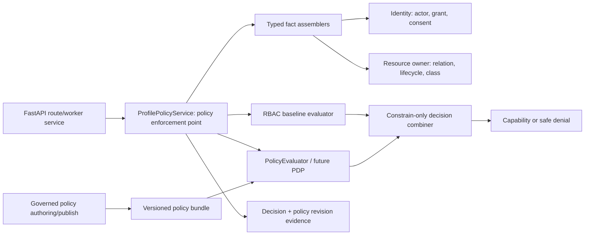
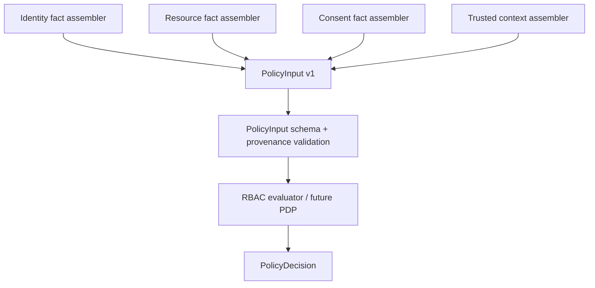
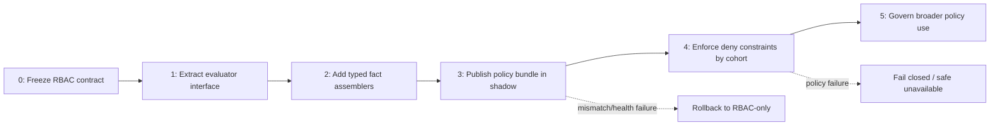

# RBAC to PBAC Evolution

## 1. Goal and scope

Nirog should begin with understandable, auditable RBAC role templates and persisted profile-grant permission snapshots. It should later be able to express context-aware access rules without rewriting routes, reissuing every existing grant, embedding a policy engine in every module, or changing the meaning of a past access decision. This document defines the seam for that evolution.

In this architecture, **PBAC** means a governed policy-based access-control layer that evaluates a typed request context and returns a decision. It can incorporate RBAC roles/permissions as one input, relationship and consent facts as other inputs, and selected trusted resource/environment attributes where product requirements justify them. NIST describes PBAC as authorization policy flexible in the parameters it may evaluate, including identity, role, operational need, risk, and related conditions; its ABAC guidance similarly frames decisions in terms of subject, object, action, and environmental attributes.[1] [2]

The first policy use is **constraining only**. Existing RBAC grants remain the authority baseline. A future policy may add an additional denial condition—such as an evidence-classification or consent/purpose requirement—but it cannot allow an action whose active owner/grant snapshot lacks the required permission. This avoids an accidental access expansion during migration.



## 2. Stable interfaces introduced now

The policy boundary is a Python protocol with immutable input/output types. The default implementation, `RbacPolicyEvaluator`, contains the current deterministic owner/grant/permission logic. `ProfilePolicyService` remains the policy-enforcement point used by FastAPI dependencies and application services; it delegates evaluation rather than exposing evaluator implementation details to routes. This is the critical seam: application code depends on a stable **decision contract**, not a role-name switch or a vendor SDK.

```python
class PolicyEvaluator(Protocol):
    def evaluate(self, request: PolicyInput) -> PolicyDecision:
        """Return a deterministic allow/deny decision and safe obligations."""

@dataclass(frozen=True)
class PolicyInput:
    subject: SubjectAttributes
    relationship: RelationshipAttributes
    resource: ResourceAttributes
    action: Permission
    consent: ConsentAttributes
    context: EnvironmentAttributes
    policy_selector: PolicySelector

@dataclass(frozen=True)
class PolicyDecision:
    outcome: PolicyOutcome  # ALLOW, DENY, UNAVAILABLE
    reason_code: DecisionReason
    policy_revision: str
    obligations: tuple[PolicyObligation, ...]
    decision_ref: PolicyDecisionRef
```

| Contract element | Required rule | What it prevents |
|---|---|---|
| `PolicyInput` | Frozen, bounded, versioned schema assembled server-side from canonical owners. | Untrusted Flutter attributes and implicit database access inside policies. |
| `PolicyEvaluator` | Synchronous deterministic contract for the request path; explicit timeout/error outcome. | Routes silently bypassing policy because a remote call fails. |
| `PolicyDecision` | `ALLOW`, `DENY`, or `UNAVAILABLE`; stable reason code/revision/obligations, never arbitrary explain text. | Leakage of rule logic and ambiguous `None`/exception behavior. |
| `ProfilePolicyService` | Combines actor, RBAC, relation, consent, and evaluator result; issues capability only after final allow. | Each module inventing its own evaluator composition. |
| `PolicyObligation` | Narrow allowlisted instruction, e.g. `audit_sensitive_read`, `require_recent_auth`, `redact_response_field`. | A policy bundle executing arbitrary module code or constructing a raw response. |
| `PolicyDecisionRef` | Opaque reference retained in audit, not a serialized rule trace for mobile clients. | Audit console/client becoming a policy-debugging information leak. |

The implementation may initially instantiate `RbacPolicyEvaluator` in-process. A later PDP may also remain in-process through a compiled, signed policy bundle; a networked policy service is not an automatic improvement for a modular monolith and should be introduced only with latency, availability, tenancy, and operational requirements. In either case, the FastAPI route and module handler interface remains unchanged.

## 3. Trusted policy attributes

Policies are limited by the quality and provenance of their inputs. Every attribute has an owner, type, freshness expectation, classification, and use restriction. Policies do not query arbitrary tables, call external providers, parse a token, or receive whole profile/document records. Fact assemblers obtain the minimum typed facts from authoritative modules and produce a bounded `PolicyInput`.

| Attribute group | Examples | Canonical owner | Validation and use rule |
|---|---|---|---|
| Subject | Account ID reference, account status, authenticated assurance level, workforce role snapshot, registered-device state. | Identity/OIDC verifier. | Server-derived only; no raw token, email, or client role claim. |
| Relationship | `owner`, active grant ID/version, grant role source, effective permission set/hash, grant expiry. | Identity. | Must be live at evaluation time; team membership is excluded unless a future approved policy explicitly defines it. |
| Resource | Resource kind/ID reference, profile ID, classification, lifecycle, owner module, aggregate/release version. | Resource-owning module. | No raw image, OCR text, note, medication name, or arbitrary row JSON. |
| Action | Registered permission/action and command/query kind. | Permission registry/API contract. | Closed enum; policy cannot invent an action string. |
| Consent/purpose | Consent state/version, purpose, scope category, expiry/revocation status. | Identity. | Consent fact is a condition, not a profile relationship replacement. |
| Environment | Request time bucket, service/workload identity, session/device assurance, policy-compatible regional/network category where approved. | Edge/Identity/platform. | Trusted, minimized, documented; never client-supplied GPS/IP text as an authority fact. |
| Governance | Registry release, policy selector, rollout cohort, feature gate. | Platform control plane. | Server-selected, versioned, auditable, never a query parameter. |



The policy-input schema is itself a versioned artifact. Adding a field is backward-compatible only if the currently selected policy bundle ignores its absence or has a defined default. Removing or changing semantics requires a new input version and rollout compatibility statement. A policy evaluation never falls back to interpreting an unknown/missing attribute as a permissive value.

## 4. Baseline decision composition

The baseline logic must be explicit before it can evolve. For a profile-scoped protected operation, the final decision is a conjunction of independent gates. The exact representation can be a decision object rather than a Boolean expression, but the security behavior is as follows:

```text
final_allow =
  authenticated_active_actor
  AND active_profile
  AND live_owner_or_profile_grant
  AND persisted_permission_contains(action)
  AND target_belongs_to_profile
  AND required_consent_and_purpose_are_current
  AND resource_lifecycle_and_context_allow
  AND policy_gate_allows
```

During the initial PBAC evolution, `policy_gate_allows` is true only when no policy is selected or the selected policy allows. It **cannot** make `persisted_permission_contains(action)` true. The decision combiner does not support “policy override allow” for a missing profile grant/permission. Any future requirement to grant a new action through PBAC must define a separate, explicit authorization source, policy grammar, review process, user experience, audit/retention behavior, migration plan, and security test suite; it is not a configuration toggle.

| Evaluator condition | Baseline mode | Shadow mode | Enforced constraint mode |
|---|---|---|---|
| RBAC denies | Deny. | Deny; record policy counterfactual only if safe. | Deny regardless of policy output. |
| RBAC allows; no selected PBAC rule | Allow after all non-policy gates. | Allow; record “not applicable.” | Allow after all non-policy gates. |
| RBAC allows; PBAC allows | Not used. | Allow by RBAC; compare. | Allow. |
| RBAC allows; PBAC denies | Not used. | Allow by RBAC; capture redacted shadow mismatch. | Deny safely and audit policy revision/reason. |
| PBAC unavailable/error | Not applicable. | RBAC baseline result; alert/measure failure. | No sensitive output/side effect; return safe temporary denial or `503` according to route semantics. |

This staged combiner preserves existing grants and gives operators proof of policy behavior before it becomes an enforcement dependency. It also provides a clear failure posture: a required, unavailable policy evaluator must never default to an allow.

## 5. Policy control plane and artifacts

The policy control plane is separate from ordinary runtime authorization. It controls authored policy source, tests, review/approval, compiled bundle, release, activation cohort, rollback, and evidence. Application users and profile owners cannot upload policy text or select a policy bundle. Catalog and profile access roles do not imply policy-administration permission.

| Artifact | Suggested record | Required governance |
|---|---|---|
| Policy source revision | `platform.policy_revisions` with `id`, `input_schema_version`, `source_checksum`, `author`, `review_reference`, `created_at`. | Immutable revision, code review, static validation, policy tests. |
| Compiled/published bundle | `platform.policy_bundles` with revision, compiler/runtime version, checksum/signature, compatibility, status. | Reproducible build, signature/checksum, explicit compatibility. |
| Rollout | `platform.policy_rollouts` with bundle, selector, mode, cohort, effective window, rollback target, approved_by. | Staged activation, monitored outcomes, reversible rollout. |
| Evaluation evidence | `platform.policy_evaluations` optional restricted projection. | Store decision ref/revision/outcome/reason/latency; never full health payload or rule trace. |
| Permission registry release | Existing/optional `platform.permission_registry_releases`. | Policy refers only to a compatible closed action vocabulary. |

The policy authoring model should start with an intentionally narrow grammar or reviewable policy-as-code framework that compiles to the above decision contract. It must support deterministic evaluation, total/explicit outcomes, bounded execution time and memory, test fixtures with synthetic data, policy input/output schema validation, and an inspectable compatibility story. A generic user-editable expression language, policy with arbitrary database/network calls, or per-request policy download is out of scope.

## 6. Extension candidates

PBAC is justified only when it reduces concrete role explosion or expresses a stable rule that cannot safely be represented by a grant permission alone. The following candidates are seams, not default policies; each needs product, privacy, legal, UX, test, and incident-response review before activation.

| Candidate constraint | Example policy question | Required facts | Why it belongs in PBAC rather than a new role |
|---|---|---|---|
| Restricted evidence class | May this caregiver retrieve a raw prescription image, not merely metadata? | Permission, grant relation, document class, consent/purpose, device/session assurance. | Avoids roles such as `caregiver_manager_image_consent_device_verified`. |
| Purpose-bound processing | May a worker fetch restricted evidence for scan stage X? | Workload identity, stage, consent purpose, document lifecycle, policy release. | Keeps workload privilege tied to current purpose and lifecycle. |
| Time-bound delegation | Is a still-live grant usable during its approved care window? | Grant window, profile relation, action, request time. | A time window is contextual, not a distinct role family. |
| Controlled exports | May an operator export a governed report? | System role, approval reference, target classification, purpose, session assurance. | Requires multiple administrative/contextual facts, not profile RBAC. |
| Step-up session control | Must raw evidence access require recent strong authentication? | Action/classification, session assurance/freshness, risk category. | Contextual condition should not become a broad static role. |
| Delegation limit | May an approved future delegate create a narrower time-bound subgrant? | Delegation chain, max set, depth, consent, action. | A relationship graph/policy rule is clearer than proliferating manager roles. |

The first enforcement policies should be simple deny constraints on a small high-risk surface, with clear source facts and safe fallback. They should not start with generalized clinical inference, opaque risk scoring, location tracking, or policy conditions based on ML output. The Nirog medication and ML safety boundary remains unchanged: policy can restrict evidence processing/disclosure but cannot make unconfirmed ML output create regimen/adherence state.

## 7. Migration roadmap

The rollout is intentionally incremental. Each phase leaves the existing RBAC authorizations functional and independently testable. The migration proceeds only after the prior phase has compatibility evidence, regression tests, and operational approval.



| Phase | Implementation work | Exit evidence |
|---:|---|---|
| 0. Freeze RBAC contract | Publish permission registry, grant snapshot semantics, action/resource map, audit reason vocabulary. | Existing access tests pass; no route relies on raw role-name checks. |
| 1. Extract evaluator | Place the current deterministic logic behind `PolicyEvaluator`; preserve all exact decisions. | Golden decision fixtures show zero behavior difference from pre-extraction. |
| 2. Add typed facts | Build read-only fact assemblers and `PolicyInput v1`; add policy revision to audit. | Provenance/field-redaction tests pass; no policy fetches arbitrary data. |
| 3. Shadow policy | Evaluate selected policies asynchronously or side-by-side after RBAC decision; record safe counterfactual outcome and latency. | Mismatch/error/latency analysis is reviewed; all shadow data is redacted. |
| 4. Constrain by cohort | Activate only approved deny rules for a narrow action/resource cohort; use explicit rollout selector and rollback. | No unexpected grant broadening; decision rate and error budgets meet threshold. |
| 5. Expand governance | Add approved policies/attributes under controlled artifact lifecycle and periodic access review. | Every policy has owner, tests, compatibility, review, monitoring, and rollback evidence. |

An RBAC template change remains its own administrative operation throughout the migration. A policy rollout is not a tool for silently redefining historic permission snapshots. If a template revision should affect users, the product executes an explicit regrant/review migration that creates new grant versions, not a runtime rewrite of old grant JSONB.

## 8. Availability, caching, and fail-safe operation

An authorization evaluator is a security dependency. The baseline RBAC evaluator should be local to the application process or served from a prevalidated in-memory policy bundle so normal protected actions do not depend on an uncontrolled network hop. If a later external PDP is required, it must have bounded timeout, circuit behavior, policy bundle/version compatibility, independent health telemetry, and a documented unavailable outcome per action class.

| Decision path | Cache posture | Failure posture |
|---|---|---|
| RBAC baseline/profile grant | Prefer current database read or short derived-fact cache keyed by grant/consent/version. | Deny if authoritative state is unavailable for a sensitive decision. |
| Selected policy bundle | Cache only validated, versioned, signed/checked bundle. | Keep last-known validated bundle only within approved TTL/rollback policy; do not download unverified policy at request time. |
| Restricted evidence/write policy | No permissive stale decision cache. | Fail closed or safe `503`; no asset capability or mutation. |
| Low-risk non-sensitive read | Explicitly documented bounded degraded mode only if no additional policy constraint is required. | Never use degraded mode for another profile’s health state or raw evidence. |
| Shadow evaluation | Independent bounded timeout. | Preserve RBAC baseline result; record/alert evaluator failure without blocking request. |

Capability/cache invalidation is driven by transactional outbox events from grant, consent, account, profile, policy rollout, and permission registry changes. The policy evaluator never uses a long-lived capability object as an authorization token; it calculates the final decision for the request/worker checkpoint from current facts.

## 9. Policy testing and review

Policies need the same rigor as source code. A policy revision is accepted only with synthetic fixtures that cover allow, deny, missing attribute, stale/revoked grant, consent change, cross-profile target, unsupported action, deadline/time-window boundary, evaluator timeout, and obligation behavior. Golden fixtures for the extracted RBAC evaluator prevent semantic drift. Shadow results are reviewed as aggregate/deduplicated evidence and never treated as permission to capture raw health content.

| Test | Required assertion |
|---|---|
| RBAC equivalence | `RbacPolicyEvaluator` outputs exactly match the frozen baseline for all fixture permutations. |
| Monotonic constraint | In constrain-only mode, no policy result allows an action denied by RBAC, relation, consent, or state gates. |
| Attribute provenance | Client-provided/wrong-owner/unknown attributes are rejected and cannot alter a decision. |
| Missing/error case | Required policy input, evaluator error, timeout, or incompatible bundle does not become an allow. |
| Redaction | Audit/trace/shadow artifacts contain only approved references/reason codes, no raw input payload. |
| Rollout/rollback | Cohort selection is deterministic and auditable; rollback returns to known RBAC-only decision behavior. |
| Obligation safety | Only declared allowlisted obligations can be emitted; no policy can call storage/database/provider code directly. |
| Worker parity | The same policy input rules apply to workload actions, with workload identity/purpose replacing end-user session facts. |

OWASP notes that roles alone do not satisfy all object-level, relationship, and contextual authorization cases. Nirog’s design responds by retaining its comprehensible RBAC baseline while adding a constrained policy seam, rather than attempting to encode every future conditional requirement as a new role.[3]

## References

[1] [NIST — Policy-Based Access Control (PBAC) Glossary](https://csrc.nist.gov/glossary/term/policy_based_access_control)

[2] [NIST — Attribute Based Access Control](https://csrc.nist.gov/projects/attribute-based-access-control)

[3] [OWASP — Authorization Cheat Sheet](https://cheatsheetseries.owasp.org/cheatsheets/Authorization_Cheat_Sheet.html)

[4] [Nirog — RBAC Baseline](01-rbac-baseline.md)

[5] [Nirog — Access Control Enforcement](02-access-control-enforcement.md)

[6] [Nirog — Security, Privacy, and Governance Architecture](../system-architecture/08-security-privacy-and-governance-architecture.md)
