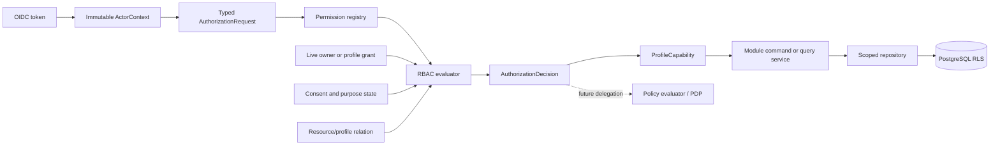

# Nirog Software and Access Architecture

## Purpose

This library defines how the Nirog FastAPI backend is structured, how it validates requests, and how it decides access to sensitive medication-management data. It converts the cross-cutting decisions already established in the technical, data-management, workflow, and unified-system architecture libraries into an implementation-facing software pattern. It does **not** replace the authoritative domain ownership or safety boundaries described in the [Unified System Architecture](../system-architecture/README.md).

The present architecture is **RBAC-first, relationship-aware, and consent-aware**. RBAC supplies a reviewable, least-privilege permission baseline. A permission alone never authorizes access to a patient profile record: the server also evaluates the current profile relationship, resource scope, consent/purpose condition, aggregate state, and request context. This avoids confusing a token, team membership, or role label with durable authority over health data.

> **Terminology decision.** In this library, **PBAC** means *policy-based access control*: a versioned policy-evaluation capability that may later consider roles, relationships, purpose, resource classification, and trusted runtime context. It is not a commitment to any specific product, policy language, or external authorization service. NIST describes PBAC as policy-based access control that can evaluate flexible parameters such as identity, role, need, risk, and other operational context.[1]

## Architectural model

Nirog begins with a deliberately small model. A validated OIDC token identifies an account, but it does not carry a permanent list of profile rights. The access service resolves the account’s present relationship to the profile and evaluates an explicit action against a typed resource reference. The resulting capability is short-lived and request-specific. Owner services and repositories then operate only within that authorized scope, while PostgreSQL Row-Level Security provides a separate, defensive row filter.

The architecture has two explicit decision planes. The **administrative plane** creates, revises, revokes, and audits role templates, grants, consents, and policy artifacts. The **runtime plane** evaluates the current request and produces an allow/deny decision with safe reason codes. Runtime requests never accept a role or permission list from Flutter as authoritative input.

| Concern | RBAC baseline now | Future PBAC extension | Invariant that does not change |
|---|---|---|---|
| Permission source | Versioned role templates expanded into persisted grant permission snapshots. | Policy may evaluate the snapshot plus trusted attributes. | Client claims do not create authority. |
| Profile relationship | Owner relationship or live `identity.profile_access` grant. | Relationship remains a first-class policy input. | Team membership alone is not profile authority. |
| Consent and purpose | Explicit gate before protected processing or disclosure. | Policy may express richer purpose, time, and resource-class combinations. | Consent alone is never a database credential. |
| Enforcement | FastAPI dependencies, application services, scoped repositories, RLS. | Same policy-enforcement points delegate to a policy evaluator. | Every protected request is checked server-side. |
| Audit | Decision/action records include permission and grant context. | Policy revision, decision trace reference, and obligations are recorded safely. | No raw token, prescription content, or health payload enters audit/log data. |

## Reading order

The documents are intentionally organized from application shape to operational evolution. Read them in this order when implementing the backend, then return to the relevant domain architecture for module-specific rules.

| Order | Document | Implementation question answered |
|---:|---|---|
| 1 | [00 — Modular Software Architecture](00-modular-software-architecture.md) | How should FastAPI modules, command/query services, types, repositories, adapters, and workers be separated? |
| 2 | [01 — RBAC Baseline](01-rbac-baseline.md) | Which roles, permissions, grant lifecycle rules, and immutable permission snapshots govern MVP access? |
| 3 | [02 — Access Control Enforcement](02-access-control-enforcement.md) | Where is authorization evaluated, how is BOLA prevented, and how are RLS and worker identities used? |
| 4 | [03 — Validation Architecture](03-validation-architecture.md) | Which validation gates must every command cross before persistence or side effects? |
| 5 | [04 — Audit and Observability](04-audit-and-observability.md) | What evidence is recorded for sensitive decisions and how is telemetry kept safe? |
| 6 | [05 — RBAC to PBAC Evolution](05-rbac-to-pbac-evolution.md) | How can Nirog introduce policy evaluation without breaking existing grants or widening access? |
| Supporting material | [Research Notes](research-notes.md) | Which authoritative access-control and validation sources informed the choices? |

## Non-negotiable implementation rules

Every protected route declares its action and resource kind; every mutation has an idempotency key and validates the aggregate version where mutable state can be changed concurrently. Authorization uses the persisted permission set on the applicable active grant, not a live role-template lookup, so changing a role template does not broaden past grants. The owner relationship is calculated from `identity.patient_profiles.owner_account_id`; caregivers require a live `identity.profile_access` row.

The authorization service must be the only shared interpreter of profile authority. A module may own resource-to-profile relationship queries, but it must not recreate its own caregiver or consent logic. Workers use narrow workload identities and the same application services; they never receive an end-user’s broad authority and cannot create regimen or adherence state from ML output. This preserves Nirog’s confirmation boundary and keeps asynchronous execution out of the authorization loophole path.

For sensitive health resources, the response must not disclose whether an inaccessible target exists. Authorization and scoped lookup must therefore be designed together: the service emits a safe `404` for a cross-profile target where disclosure policy requires it, while recording an internal denied-decision event. PostgreSQL RLS is defense in depth rather than a substitute for current request policy, resource filtering, or safe error handling.[2]

## Relationship to existing architecture

This library adopts the existing canonical physical schema names and module ownership. Profile grants remain in `identity.profile_access`; profile ownership remains in `identity.patient_profiles`; consent records remain in `identity.consents`; immutable event/audit/idempotency controls remain in `platform.*`. The subsequent documents may name carefully scoped migration additions where the implementation needs a version, assignment history, or policy artifact, but they do not move ownership between modules.

| Existing library | Contract adopted here |
|---|---|
| [User Management](../technical-analysis/01-user-management.md) | OIDC-to-local account mapping, owner/caregiver distinction, persisted `permission_set`, RLS baseline, invitation/revocation behavior. |
| [Module, Code, and Command Architecture](../system-architecture/03-module-code-and-command-architecture.md) | Modular monolith, command boundary, owner repository rule, transactional audit/idempotency/outbox, workers call application services. |
| [Security, Privacy, and Governance Architecture](../system-architecture/08-security-privacy-and-governance-architecture.md) | Layered controls, private asset capability, purpose-bound egress, workload identity, governed policy artifacts. |
| [Access, Consent, and Privacy Data Controls](../data-management/03-access-consent-and-privacy.md) | Relationship, consent/purpose, current policy version, RLS reset, and revocation/expiry semantics. |

## References

[1] [NIST — Policy-Based Access Control (PBAC) Glossary](https://csrc.nist.gov/glossary/term/policy_based_access_control)

[2] [PostgreSQL — Row Security Policies](https://www.postgresql.org/docs/current/ddl-rowsecurity.html)

[3] [OWASP — Authorization Cheat Sheet](https://cheatsheetseries.owasp.org/cheatsheets/Authorization_Cheat_Sheet.html)
