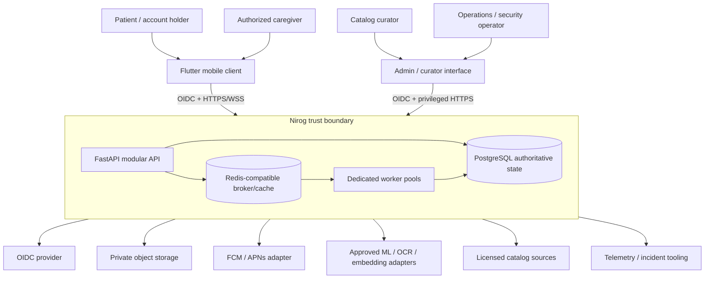

# System Context and Quality Attributes

## 1. System purpose

Nirog is a medication-management system that helps an authorized person preserve prescription evidence, review ML-assisted extraction, create a profile-private regimen, manage reminders and dose evidence, and maintain advisory refill state. It is not an EHR, a prescribing system, or a diagnostic engine. The architecture therefore separates **reference facts**, **restricted evidence**, **authorized medication actions**, and **derived operational effects**.

The client is a protected presentation and local-intent layer. It can display status, send idempotent commands, maintain a constrained offline queue, and render permitted changes. It cannot decide profile authority, grant itself a storage capability, activate a regimen from a candidate, or infer dose completion from a notification. The backend evaluates these decisions against current state.

## 2. Stakeholder and trust contract

| Actor or system | Legitimate role | Cannot be treated as |
|---|---|---|
| Account holder | Authenticates, selects a profile, uploads evidence, confirms/manual-enters regimen instructions, logs dose behavior. | Authority for another profile without an effective ownership/grant decision. |
| Caregiver | Uses only the current permissions and purposes represented by `identity.profile_access` and consent. | A team member who automatically sees health data. |
| Catalog curator | Curates shared source facts and publishes immutable releases. | An editor of a person’s regimen or prescription evidence. |
| ML/provider adapter | Creates stage-bound observations and outputs under a restricted workload identity. | A clinical decision maker or regimen writer. |
| Notification provider | Receives a minimal delivery request and returns delivery telemetry. | Proof that medication was consumed. |
| Operations role | Performs controlled release, recovery, or retention operations with audited breakpoints. | A routine application identity with unrestricted health-data access. |

## 3. Architectural quality attributes

Nirog prioritizes safety, traceability, confidentiality, correctness under retry, and controlled change above raw feature breadth. Performance and availability remain important, but the system degrades to visible pending status, retry, or manual entry rather than silently converting uncertainty into medication action.

| Quality attribute | Architecture response | Evidence expected before release |
|---|---|---|
| **Medication safety** | Evidence/review boundary, explicit Regimen command, immutable versioning, no ML role grant to regimen/adherence tables. | Negative tests prove candidate/worker payloads cannot create a regimen. |
| **Privacy and least privilege** | OIDC account validation, profile capability, repository scope, RLS, private assets, minimal queue messages, adapter allowlists. | BOLA, grant-revocation, pooled-RLS, object-capability, and redaction tests. |
| **Reliability** | Atomic aggregate/audit/idempotency/outbox commit, at-least-once consumers, durable leases and reconciliation. | Relay-crash, duplicate-delivery, retry, DLQ, provider-uncertainty tests. |
| **Explainability** | Evidence source links, stage manifests, catalog/index/policy releases, review decisions, regimen versions, audit and provenance. | A historical result can be reconstructed without substituting a newer release. |
| **Operability** | Isolated worker pools, traces, redacted metrics/logs, backup/restore drills, bounded rollouts and recovery runbooks. | Staging failure injection and restoration/rebuild exercise. |
| **Evolution** | Modular monolith dependency rules, versioned contracts, expand/migrate/contract changes, later extraction only on measurable pressure. | Compatibility test and rollback/compensation plan for every material change. |

## 4. Context-level constraints

The system must preserve the distinction between a shared catalog product and a personal regimen, between delivery telemetry and dose evidence, and between a source asset and an ML-derived field. It must use only configuration-approved external adapters; provider payloads remain outside general logs and generic queue messages. A vendor choice is replaceable at the adapter boundary, but release provenance makes any result attributable to the provider/model/configuration actually used.

## References

[1] [Nirog Architecture Reconciliation](00-architecture-reconciliation.md)

[2] [NIST Privacy Framework](https://www.nist.gov/privacy-framework)

[3] [HL7 FHIR Workflow](https://hl7.org/fhir/workflow.html)
