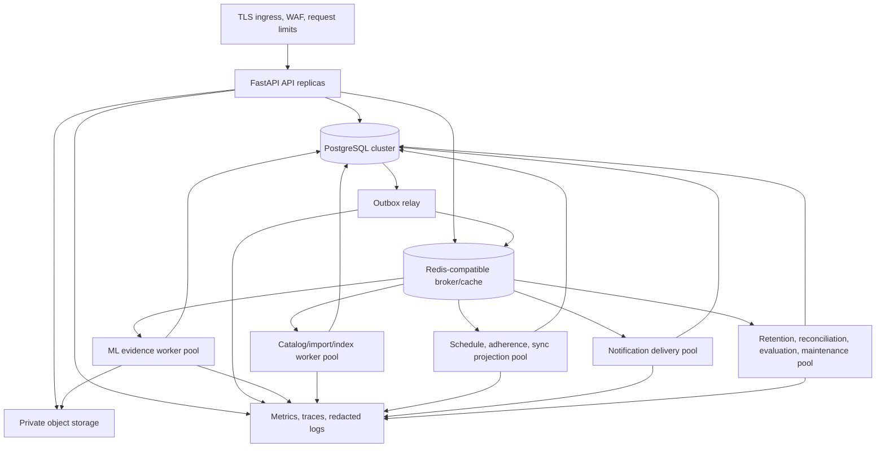

# Runtime, Process, and Deployment Topology

## 1. Deployment shape

Nirog deploys as a **modular monolith with separately scaled processes**, not as a network of independently owned microservices. The API and workers use the same module contracts and one authoritative PostgreSQL cluster. Process isolation prevents expensive ML, catalog, or maintenance work from exhausting API, schedule, or notification capacity without introducing distributed business ownership.

## 2. Process responsibilities

| Process | Owns at runtime | May write | Must not do | Primary scale signal |
|---|---|---|---|---|
| API replicas | Request validation, actor/profile capability, synchronous commands/queries, restricted capability grants. | The command owner’s aggregate plus audit/idempotency/outbox in one transaction. | Wait for model inference, large import/index, provider completion, or bulk projection. | Request concurrency, latency, CPU/memory, database pool wait. |
| Outbox relay | Claim/publish committed `platform.outbox_events`; record publication metadata. | Platform relay fields only. | Alter business aggregate, invent events, or treat broker acknowledgement as business completion. | Oldest unpublished outbox age and relay claim failures. |
| ML pool | Evidence stages through module-controlled application service. | Permitted `prescription.*` stage/evidence records. | Write regimen, adherence, profile access, or generic catalog facts. | Stage age, provider quota, task duration, GPU/CPU/resource limit. |
| Catalog pool | Import, validate, curate support, build index release. | Permitted `catalog.*` execution/release records. | Process profile evidence or publish a user correction without governed curation. | Import/index queue age, source size, validation failures. |
| Projection pool | Future occurrence, adherence/read, sync-derived projections. | Adherence/platform projections through their owner. | Rewrite historical dose evidence or regimen policy. | Event lag, projection freshness, rebuild backlog. |
| Notification pool | Persist deterministic delivery intent/telemetry and call push adapter. | `adherence.notification_*` only. | Treat provider acceptance as dose evidence. | Due delivery age, provider errors, device failure rate. |
| Maintenance pool | Retention, reconciliation, evaluation, scheduled integrity work. | Controlled platform/owner-service outcomes. | Bypass lifecycle holds or arbitrary cross-schema deletes. | Job SLA age, reconciliation drift, retention backlog. |

## 3. Storage and network boundaries

PostgreSQL stores canonical transactions, append-oriented evidence/control records, release provenance, and projection state. Private object storage contains source pages, derived artifacts, and permitted raw provider outputs referenced by manifests; it has no public bucket or permanent browser URL. Redis-compatible infrastructure provides broker/cache functions but never becomes the authoritative medication, authorization, or evidence record. External adapters are outbound, typed, allowlisted boundaries that use workload identity, timeouts, classified retry, and redacted telemetry.

| Boundary | Inbound rule | Outbound rule | Failure posture |
|---|---|---|---|
| Public edge → API | TLS, rate/cost limits, validated size/type/body, correlation ID. | Safe problem response with no provider/SQL/other-profile detail. | Reject or return committed/accepted status; do not expose internals. |
| API/worker → PostgreSQL | Separate application, worker, migration, and owner roles; transaction-local scope after policy. | No open transaction during model/provider call. | Rollback command; outbox prevents lost deferred effect. |
| Runtime → object storage | Narrow upload/read capability or service-grant recheck. | Checksums, content scanning/type validation, audit. | Expire/cancel/retry according to current policy and retention. |
| Worker → external provider | Typed minimal request, deterministic key where side-effecting, release/version tags. | No raw response in general telemetry. | Bounded retry, circuit/defer, or reconcile unknown result. |

## 4. Environments and release isolation

Development, staging, and production are separately configured environments with distinct identity clients, databases, object prefixes/buckets, queues, credentials, telemetry datasets, and configuration releases. Production data never becomes a generic development fixture. A production rollout is compatible before activation; worker queues drain gracefully during termination and pick up new work only after readiness checks pass.

## References

[1] [Nirog Deployment and Scaling Guide](../technical-analysis/08-deployment-and-scaling-guide.md)

[2] [Transactional Outbox Pattern, AWS Prescriptive Guidance](https://docs.aws.amazon.com/prescriptive-guidance/latest/cloud-design-patterns/transactional-outbox.html)
