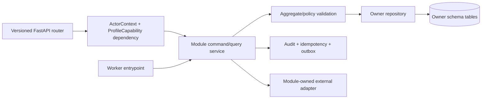

# Module, Code, and Command Architecture

## 1. Code organization

The FastAPI application is organized as module-owned domain/application/infrastructure/API layers. A router parses input and resolves dependencies; a command/query service applies policy and state transition; a repository persists only its module’s tables; an event mapper emits a versioned envelope through the same transaction. Worker entrypoints call the same application services rather than duplicating business policy in task code.



```text
app/
  api/v1/                 # route wiring, request/response, problem mapping
  modules/
    identity/             # domain, application, infrastructure, api
    catalog/
    prescription/
    regimen/
    adherence/
    platform/
  workers/                # task entrypoints; never a parallel domain layer
  shared/                 # typed IDs, time, result/errors, telemetry
  migrations/             # module-owned migration sequence
```

## 2. Dependency and write rules

| Module | Owns commands | Owns physical schema | May consume | Prohibited shortcut |
|---|---|---|---|---|
| Identity | Account lifecycle, profile/grant/consent/device state. | `identity.*` | Authentication input, controlled sharing actions. | Let team membership or token claim stand in for profile authority. |
| Catalog | Source/import/curation/release/index lifecycle. | `catalog.*` | Curator commands and private feedback as curation candidates. | Write user regimen or accept private correction as global fact. |
| Prescription | Asset manifest, scan request/stage/review evidence. | `prescription.*` | Profile capability, named catalog/index context. | Write regimen/adherence state from a worker or score. |
| Regimen | Manual/evidence-assisted plan creation, version/change/stop, schedule policy, inventory. | `regimen.*` | Authorized manual command or confirmed evidence decision. | Mutate catalog or treat notification delivery as dose evidence. |
| Adherence | Dose events, future occurrence projection, notification intent/delivery, summaries. | `adherence.*` | Schedule/inventory changes and current device state. | Edit a regimen policy or infer taken dose from provider acknowledgement. |
| Platform | Idempotency, outbox, consumer ledger, audit, sync change records, retention/recovery control. | `platform.*` | Versioned events from all owners. | Make business/clinical decisions or delete business rows directly. |

## 3. Command boundary

Every mutation supplies an idempotency key and an aggregate version when it changes mutable current state. The command service validates actor and profile capability, resource relationship, input schema, current state, release/policy constraint, and base version. It persists the owned change, redacted audit, idempotency outcome, and outbox row atomically. It returns the committed aggregate representation or a `202` job resource; derived work starts after commit.

| Command class | Synchronous output | Deferred work |
|---|---|---|
| Identity/share/revoke | Current state/change receipt. | Cache invalidation, safe cancellation/recheck for affected sensitive work. |
| Catalog publish | Immutable release/current-pointer result. | Index build, cache invalidation, consumer release refresh. |
| Evidence upload/scan | Document/upload grant or scan-job resource. | Ingest and stage graph. |
| Review confirmation/manual regimen | Regimen version/current representation. | Future occurrence, notification, sync projection. |
| Dose/refill command | Append-only event or current inventory result. | Summary/refill advisory/sync projection. |

## 4. Event contract

Event envelopes use stable event ID, type/version, aggregate type/ID/version, optional profile scope, occurred time, causation/correlation IDs, payload version, and minimal payload. A consumer must never authorize a business effect only from the envelope. It claims its ledger record, re-reads the owner’s current authoritative state, verifies expected version/policy/release/lifecycle, then commits an owned effect, a safe no-op, retry state, or terminal recovery state.

## References

[1] [Nirog Technical System Architecture](../technical-analysis/00-system-architecture.md)

[2] [Nirog Design Workflows: Workflow Contract](../design-workflows/00-foundations/01-workflow-contract-and-state-vocabulary.md)

[3] [OWASP API1:2023 Broken Object Level Authorization](https://owasp.org/API-Security/editions/2023/en/0xa1-broken-object-level-authorization/)

