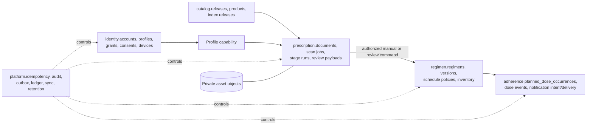

# Canonical Data, Schema, and Provenance Architecture

## 1. Authoritative versus derived data

The data architecture begins by classifying each record as canonical business state, immutable evidence/control history, shared reference release, derived projection, or restricted object asset. PostgreSQL is authoritative for transactional state and durable control records. Object storage holds restricted binary/text artifacts referenced by PostgreSQL manifests. Search indexes, cache entries, future occurrence projections, adherence summaries, and provider delivery views are rebuildable; they never become the authority for a medication action.

## 2. Physical schema contract

| Schema | Canonical records | Critical constraints | Rebuildable or auxiliary records |
|---|---|---|---|
| `identity` | `accounts`, `auth_identities`, `patient_profiles`, `profile_access`, `consents`, `devices`. | Unique issuer/subject; one effective profile grant; account/profile lifecycle. | Capability cache, policy-decision projection. |
| `catalog` | `sources`, `import_batches`, `releases`, `products`, `ingredients`, aliases, curation cases, `index_releases`. | Published release immutability; source checksum; release/index compatibility. | Lexical/vector index artifacts. |
| `prescription` | `documents`, pages/assets manifests, `scan_jobs`, `stage_runs`, extracted fields/candidates, review payloads/decisions. | Immutable source/evidence lineage; stage fingerprint; review version; profile scope. | Thumbnails, permitted OCR/search projection. |
| `regimen` | `regimens`, `regimen_items`, `regimen_versions`, `schedule_policies`, inventory/refill records, private unresolved items. | One profile scope; version precondition; source confirmation/manual provenance. | Current display view. |
| `adherence` | `planned_dose_occurrences`, `dose_events`, `notification_intents`, `notification_deliveries`. | Append-only dose evidence; deterministic delivery key; occurrence/source-version relationship. | Summaries, reminder queue views, refill advisory. |
| `platform` | `idempotency_records`, `outbox_events`, `consumer_ledger`, `audit_events`, `change_events`, retention/recovery/provenance records. | Unique request/consumer keys; append/restricted audit; ordered scoped change sequence. | Dashboards and materialized operations metrics. |

## 3. Version, lineage, and temporal meaning

Every material result carries the version context that makes it explainable later. Evidence stages record input fingerprint, input/derived artifact checksums, stage revision, model/provider, prompt/parser, catalog/index, policy, and schema releases. Catalog match candidates remain attached to their named release/index. A regimen version points to the authorized manual source or confirmation/review source. Planned occurrences preserve the regimen version that generated them; later schedule changes only rebuild future projection.

| Concern | Required record or invariant |
|---|---|
| Offline replay | Unique device/client command or platform idempotency record with request digest and original resolution. |
| Mutable medication instruction | Monotonic regimen version, optimistic base-version check, author/reason/effective period. |
| Evidence reproducibility | Immutable stage run and execution manifest; changed material input creates new lineage. |
| Shared reference reproducibility | Immutable catalog release and named compatible index release. |
| Event correctness | Aggregate version and `platform.outbox_events` event ID/sequence. |
| Historical access/data action | Redacted `platform.audit_events` plus provenance link/activity where needed. |

## 4. Data access and lifecycle

`profile_id` is an ownership reference, not an authorization decision. The API evaluates current profile capability before setting transaction-local scope; repositories apply profile/resource filters; RLS provides a final database constraint for high-risk rows. The runtime role lacks `BYPASSRLS`; owner/migration roles are separate. RLS uses default-deny when enabled without an applicable policy, while role/owner behavior must be tested deliberately.[1]

Data lifecycle is class-specific. Restricted evidence uses purpose-bound asset access, retention class, hold, purge fence, derivative/index cleanup, and verified completion. Profile health records use governed retention and audit. Shared catalog releases stay historically resolvable. Operational telemetry contains redacted IDs/dimensions, not raw prescription content. Restoration occurs in isolation; policy, outbox, provider intent, indexes, and projection status are reconciled before normal access resumes.

## References

[1] [PostgreSQL Row Security Policies](https://www.postgresql.org/docs/current/ddl-rowsecurity.html)

[2] [Nirog Data Management: Canonical Records and Lineage](../data-management/02-canonical-records-and-lineage.md)

[3] [Nirog Schema Ownership Reconciliation](../pre-analysis/schemas/subsystem-schema-ownership.mdx)
