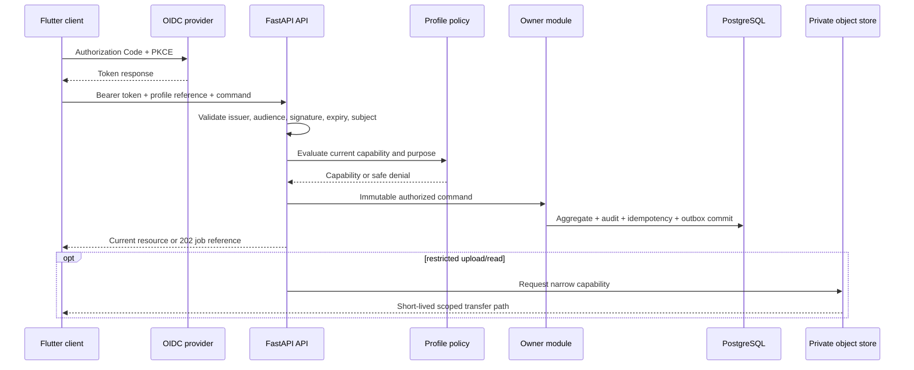

# API, Mobile, and External Interface Architecture

## 1. Interface principles

Nirog exposes versioned HTTPS APIs, limited server-sent or socket status channels where needed, and an ordered authorized change feed for Flutter. The public contract returns resources, immutable operation receipts, or accepted-job references; it does not expose internal queue payloads, audit rows, raw object keys, provider JSON, or cross-profile detail. Every mutation is idempotent, and every sensitive resource route recomputes current profile authority before owner-service access.

## 2. API contract shape

| Concern | Nirog implementation rule |
|---|---|
| Versioning | Public routes begin `/v1`; resources/events have independent schema versions. Breaking compatibility uses parallel representation or `/v2`. |
| Authentication | OIDC authorization-code flow with PKCE for Flutter; backend validates configured issuer, audience, signature/algorithm, expiry, and subject. |
| Authorization | A token maps to local account identity. A server-side policy creates profile capability from current ownership/grant/consent/purpose/action/resource. |
| Mutation safety | `Idempotency-Key`, request hash, aggregate `If-Match`/`baseVersion`, problem response with correlation/retry semantics. |
| Async work | Return `202` and job URL/state for scans, imports, indexes, long maintenance, or provider-latent work. |
| Pagination/sync | Opaque keyset cursor; sync changes use monotonic profile-scoped sequence and current capability filtering. |
| Evidence transfer | API issues narrow upload/read capability; completion validates checksum, type, size and policy. |

## 3. Flutter offline and sync contract

Flutter stores the user’s pending intent and a minimally required permitted view. An offline command contains a device-generated client event ID, profile reference, command type, base version, client occurrence time, and validated payload. The server resolves it as accepted, already applied, conflict, or rejected. A repeat with the same content returns the original resolution; reuse of the key with a different request is a conflict.

| Mobile situation | Backend behavior | Client behavior |
|---|---|---|
| Device offline | No server-side state changes until submission. | Queue protected intent; never fabricate completion. |
| Duplicate submission | Idempotency record returns prior outcome. | Mark local intent resolved once. |
| Stale regimen edit | Version conflict returns safe current metadata. | Refresh/reconcile; user chooses a valid next action. |
| Profile access revoked | Sync reads deny or return required tombstone/resync policy. | Remove inaccessible local view; do not retry as authority. |
| Reminder provider late/fails | Delivery telemetry updates; no dose event created. | Present permitted delivery state; user reports dose separately. |

## 4. External adapters

Each external system is behind a module-owned typed adapter. The adapter contract names allowed egress fields, caller identity, timeout, retry classification, idempotency behavior, release/configuration ID, telemetry tags, and redaction rule. Provider-specific payloads are not general domain records.

| Adapter | Owned by | Minimum request | Safe failure response |
|---|---|---|---|
| OIDC/JWKS | Identity | issuer/client configuration, token validation data. | Deny authentication safely; do not reveal parser/key details. |
| Object storage | Prescription/Platform | restricted asset reference, operation, checksum/type constraints. | Expire/regrant after policy check; no durable public object URL. |
| ML/OCR/embedding | Prescription | stage reference and minimal permitted asset/text context. | Stage retry/manual-review path; preserve no raw payload in generic logs. |
| Push provider | Adherence | deterministic delivery intent and minimal non-sensitive notification content. | Persist delivery failure/unknown status; reconcile before resend. |
| Catalog source | Catalog | licensed manifest/source artifact. | Validate/quarantine; no partial release publication. |

## References

[1] [OpenID Connect Core 1.0](https://openid.net/specs/openid-connect-core-1_0.html)

[2] [Nirog API, Persistence, and Security Architecture](../technical-analysis/05-api-persistence-security.md)

[3] [Nirog Mobile and Notification Workflows](../design-workflows/05-mobile-and-notification/01-offline-intent-and-sync.md)
