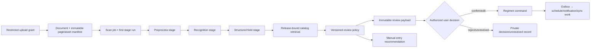

# Prescription Evidence and ML Architecture

## 1. Safety objective

The evidence subsystem converts a profile-scoped prescription document into a traceable review surface. It may classify, preprocess, recognize, parse, normalize, retrieve, rerank, and evaluate policy. It may not diagnose, prescribe, infer an active regimen, update schedule/adherence state, or treat a high model score as an authorization substitute. **Evidence is not action.**

## 2. Stage and release contract

Each stage receives identifiers and expected fingerprints rather than a client token, broad profile context, or raw object URL. It obtains permitted input through workload identity and restricted service capability. A stage run is append-oriented and records stage/attempt/status, canonical input fingerprint, parent artifact checksums, execution manifest, permitted raw-result asset reference, parsed result, error class, and next action. A changed material input creates new lineage; a retry with unchanged material input creates a bounded new attempt.

| Material input that requires lineage distinction | Why it matters |
|---|---|
| Source page/artifact checksum or preprocessing revision | The visual/text input changed. |
| Model/provider/revision or prompt/parser/schema | A different computation generated the value. |
| Catalog release/index or abbreviation/reference release | Candidate context changed. |
| Policy release/calibration/rule configuration | Review treatment changed. |
| Evaluation-approved rollout configuration | The stage is running under a distinct approved operational posture. |

## 3. Review and regimen boundary

The review policy is a versioned deterministic function over measurable signals: image quality, recognition reliability, field validation, candidate compatibility, calibrated likelihood/margin, hard policy rules, and coverage. It produces `ready_for_review`, `review_required`, `manual_entry_recommended`, or safe failure states with machine-readable reasons. A preselection is an interface convenience only; it never bypasses confirmation.

The evidence-assisted route validates a current `regimen.write` capability, reviewable scan status, exact immutable evidence version, release-bound product compatibility or explicit private unresolved path, edited field schema/policy, and idempotency. It invokes the Regimen module command synchronously. An independently authorized manual regimen command remains a valid non-evidence entry point. The outbox is created after the regimen transaction for derived effects; no worker creates the regimen.

## 4. Failure and minimization

| Condition | Result |
|---|---|
| Temporary storage/model/network/provider fault | Bounded retry with state/fingerprint preserved; visible processing state. |
| Corrupt image or unsupported content | Terminal safe error; retake/manual-entry route. |
| Invalid model output or parser mismatch | Reject/retain permitted restricted reference; review/manual path, no unsafe normalization. |
| Catalog/index unavailable | Pending retry or manual route; no fabricated product match. |
| Access revoked/cancel/purge wins | Stop before input fetch/output commit; record safe no-op/lifecycle result. |
| Provider outcome unknown | Persist intent and reconcile deterministic key before resend. |

Raw OCR, crops, provider responses, and source images remain restricted evidence. Queue/log/metric payloads contain IDs, fingerprints, classifications, durations, and release references only. The evaluation system measures safety-relevant field, alignment, calibration, correction, compatible-match, latency, and failure distributions rather than relying on a generic accuracy claim.

## References

[1] [Nirog ML Evidence Pipeline and Safety Architecture](../technical-analysis/03-ml-evidence-safety.md)

[2] [Nirog Evidence and ML Data Lifecycle](../data-management/04-evidence-and-ml-data-lifecycle.md)

[3] [Celery Task Idempotence and Sensitive Arguments](https://docs.celeryq.dev/en/stable/userguide/tasks.html)

