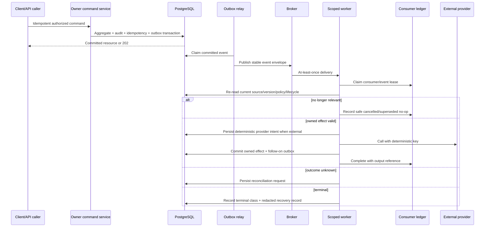

# Event, Worker, and Consistency Architecture

## 1. Consistency model

Nirog uses strong consistency inside a module command transaction and controlled eventual consistency for deferred projections and external effects. A command writes the owned aggregate, redacted audit record, idempotency result, and `platform.outbox_events` row atomically. The outbox relay later publishes a stable envelope. This avoids a committed business change being lost because immediate task publication failed, while accepting that delivery can be duplicated.[1]

## 2. Event envelope and order

| Envelope field | Purpose |
|---|---|
| `eventId`, `eventType`, `payloadVersion` | Stable identity and independently versioned consumer contract. |
| `aggregateType`, `aggregateId`, `aggregateVersion` | Supports per-aggregate ordering/relevance validation. |
| `profileId` when applicable | Enables policy-scoped consumer lookup, never grants permission itself. |
| `occurredAt`, `causationId`, `correlationId` | Traces causality without carrying restricted content. |
| Minimal payload/reference | Lets consumer re-read authoritative records; never carries raw evidence, token, password, or broad object URL. |

Per-aggregate version is a relevance guard, not a global ordering system. Consumers handling a projection re-read the current source and compare source version/release/policy before commit. If an old event arrives after a successor, the correct result is often a recorded superseded no-op, not another retry.

## 3. Worker controls

| Control | Durable record | Rule |
|---|---|---|
| Relay claim | `platform.outbox_events` lease/publication state | Publish only committed events; tolerate relay crash after publish. |
| Consumer claim | `platform.consumer_ledger` unique consumer/event lease | Duplicate completed delivery does not repeat owned durable effect. |
| Retry | Consumer status, error class, next attempt, attempt/age budget | Retry only temporary, still-relevant work with jittered bounded backoff. |
| Provider intent | External-effect record/deterministic key | Reconcile unknown outcome before any resend. |
| Dead letter | Redacted recovery entry with source/release/version | Requeue creates a new authoritative-state attempt, not stale payload replay. |
| Scheduled reconciliation | Job/reconciliation record and expected state | Detects missed relay work, uncertain provider state, stale lease, projection drift. |

## 4. Workload classes

ML stages, catalog import/indexing, future occurrence/adherence/sync projection, notification delivery, retention/purge, evaluation, and reconciliation run on separate queues/pools. They share behavior contracts but not resource budgets. An ML saturation condition may delay scans and surface manual entry; it must not starve regimen edit, notification telemetry, or sync. A stopped regimen makes downstream delivery work stale; it does not erase prior dose evidence.

## 5. External side-effect safety

No transaction remains open during a provider call. A task first commits its provider intent with a deterministic key, executes under timeout/circuit/retry policy, then records provider outcome or reconciliation request. Provider acceptance is an effect/telemetry outcome, not a clinical fact. The same rule applies to push notifications, object transformations, model calls, and any future external integration.

## References

[1] [Transactional Outbox Pattern, AWS Prescriptive Guidance](https://docs.aws.amazon.com/prescriptive-guidance/latest/cloud-design-patterns/transactional-outbox.html)

[2] [Nirog Async Workers Architecture](../technical-analysis/04-async-workers.md)

[3] [Nirog Detailed Worker Failure Recovery Workflow](../design-workflows/06-async-and-recovery/02-retry-dead-letter-and-reconciliation.md)
