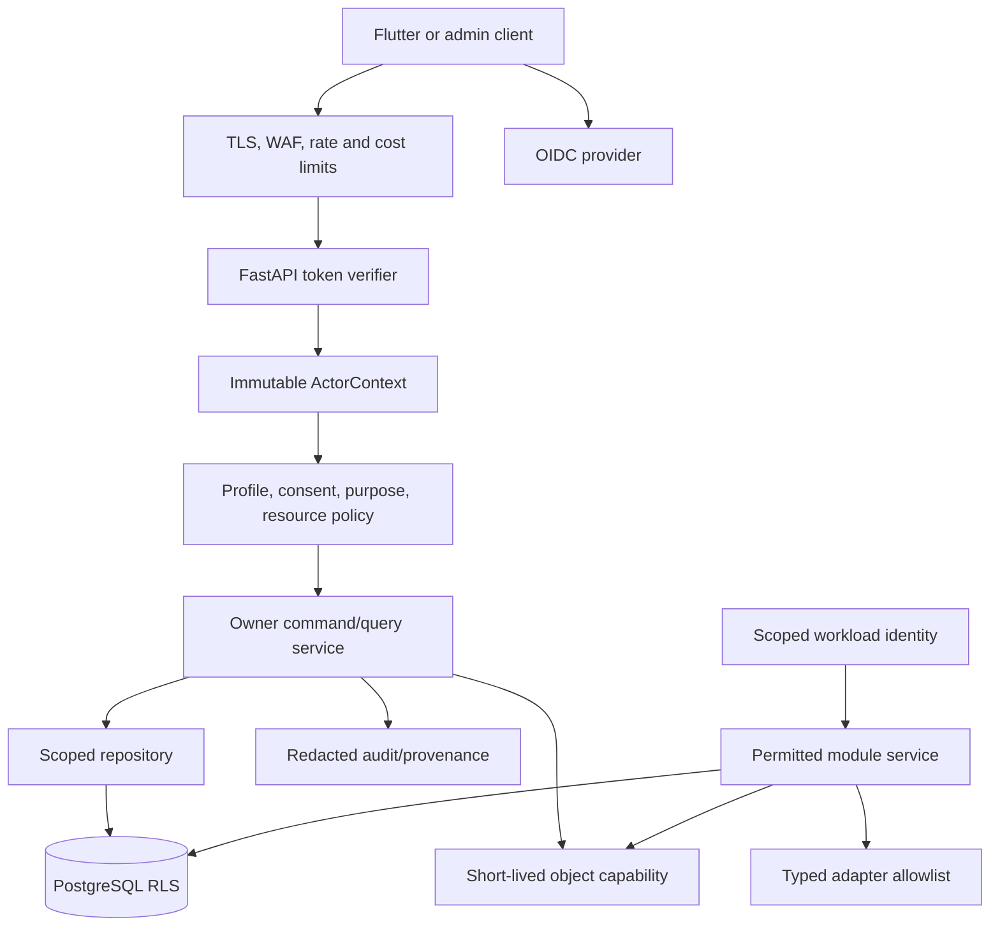

# Security, Privacy, and Governance Architecture

## 1. Layered security model

Security is a chain of complementary controls. OIDC authenticates the account; policy evaluates a current profile capability; module service/repository scope enforces ownership; PostgreSQL RLS limits rows; workload identity limits process rights; private asset capabilities limit storage access; egress rules limit provider data; audit/provenance creates evidence of sensitive action. No one layer substitutes for another.

## 2. Authentication and authorization

The API validates configured OIDC issuer, audience, signature/allowed algorithm, expiration, and subject before mapping `(issuer, subject)` to local account identity. The validated token is necessary for authentication but does not contain a permanent list of health-resource rights. Nirog computes `ProfileCapability` from account lifecycle, profile ownership or live grant, consent/purpose, action, resource relationship, time window, and current policy version.

| Decision | Required controls |
|---|---|
| Read profile health record | Valid actor; current profile capability; target-to-profile relationship; repository filter; RLS; safe disclosure policy. |
| Access raw prescription image | Above controls plus `document.read_image`/purpose, short-lived capability, audit, device/session context where policy requires. |
| Confirm/change regimen | Current `regimen.write`; version/review/manual-source validation; idempotency; audit; owner command only. |
| Curate catalog | Curator/publisher policy independent from patient profile access; source/release integrity controls. |
| Worker restricted read | Assigned workload role, source/stage/release/purpose recheck, narrow service grant; no end-user token. |

RLS acts as defense in depth. Application and worker roles must not be table owners or have `BYPASSRLS`; migration and carefully audited operator roles are separate. Connection-pool checkout/return resets transaction-local scope. PostgreSQL notes that RLS defaults to deny when enabled without an applicable policy and that owners/bypass roles require special handling.[1]

## 3. Data protection and egress governance

| Class | Protection posture | Permitted egress |
|---|---|---|
| Account identity | Encryption, redacted logs, local identity service scope. | OIDC linkage only as needed; never general ML input. |
| Profile health context | Capability/RLS/audit, encrypted backup, minimized analytics. | Authorized Flutter view and permitted operations only. |
| Restricted evidence | Private storage, narrow grants, lifecycle/purge controls, no generic messages. | Only stage-specific ML/provider adapter fields under approved purpose. |
| Shared reference catalog | Release checksum/provenance, curated publication. | Cache/search/index; no profile data. |
| Control/audit/telemetry | Append/restricted access, safe diagnostics. | Observability tooling with redacted fields only. |

Each external adapter declares an explicit data allowlist, purpose, credential/workload identity, timeout and retry class, deterministic key behavior, provider configuration/release ID, retention posture, and telemetry schema. Debug logging is disabled or redacted for restricted payload paths. Secrets are injected from managed storage, rotated, never committed, and never passed through broker messages.

## 4. Governance artifacts

Model releases, prompt/parser templates, catalog/index releases, policy/calibration releases, feature flags, evaluation runs, retention policy revisions, and migration plans are controlled artifacts. A material change receives an owner, immutable revision/checksum, compatibility statement, evaluation/approval evidence, rollout state, rollback or compensation path, and audit trail. This prevents a model/configuration update from silently changing the meaning of historic evidence.

## References

[1] [PostgreSQL Row Security Policies](https://www.postgresql.org/docs/current/ddl-rowsecurity.html)

[2] [OpenID Connect Core 1.0](https://openid.net/specs/openid-connect-core-1_0.html)

[3] [Nirog Access, Consent, and Privacy Controls](../data-management/03-access-consent-and-privacy.md)
