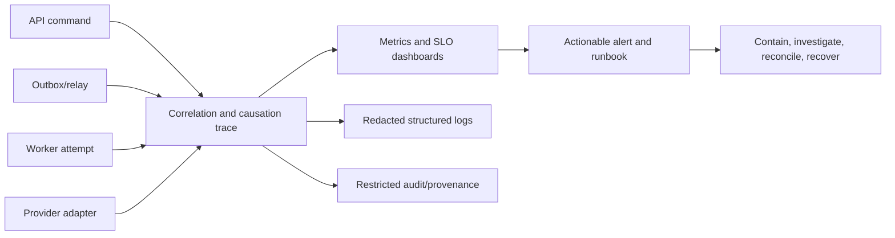
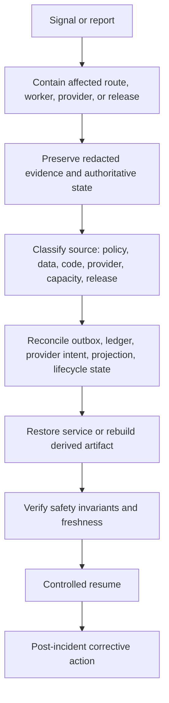

# Observability, Operations, and Recovery Architecture

## 1. Operational observability

Operational data must help detect and resolve failure without becoming an alternate health-data store. Every API command, outbox event, worker attempt, provider call, review payload, regimen command, retention operation, and recovery action carries correlation and causation context. Metrics/logs/traces record IDs, bounded dimensions, release references, safe error class, duration, queue, and outcome; they exclude raw prescription images/text, broad object URLs, secrets, and full provider responses.

| Signal family | Examples | Operational decision enabled |
|---|---|---|
| API and policy | latency, safe denial rate, BOLA/RLS regression, idempotency conflict. | Capacity, authorization regression, abusive path investigation. |
| Outbox/worker | oldest unpublished age, queue age, lease expiry, duplicate suppression, retry/DLQ rate. | Relay/worker recovery, queue isolation, error-budget action. |
| ML/evidence | stage latency/failure, manual-entry rate, parser/schema rejection, calibration/correction segment. | Safe rollout, provider capacity, evaluation and fallback decision. |
| Catalog | import finding rate, curation age, index build age, no-compatible-match rate. | Release readiness and reference-quality remediation. |
| Mobile/notification | command conflict, sync lag, revoked-device requests, due-delivery age, provider failure. | Client compatibility, push degradation, privacy/device control. |
| Data lifecycle | retention backlog, purge completion, hold exception, restore/rebuild drift. | Legal/policy compliance and recovery confidence. |

## 2. Release and change workflow

Every material change is specified with owner, compatibility, risk class, required test/evaluation evidence, telemetry expectation, activation condition, rollback/compensation method, and affected data/release artifacts. Database changes follow **expand → compatible application/worker deployment → bounded idempotent backfill → validation → controlled activation → observation → contract**. A release cannot remove a compatibility path until queues, retries, stale clients, and recovery records no longer require it.

## 3. Incident and recovery model

An incident does not justify bypassing the medication-action boundary. If evidence/ML is unavailable, users see accurate pending/failure states and can use permitted manual entry. If notification delivery is degraded, regimen and dose records remain available; the system does not mark medication taken/missed merely to compensate. If a restore is needed, it begins in an isolated environment and reconciles retention/purge status, access revocation, outbox/ledger work, provider intents, indexes, and derived projections before user access returns.

## 4. Backup, recovery, and capacity

Backups are encrypted and tested through restoration exercises, not assumed valid. The recovery objective is a policy decision determined per data class and environment; the architecture requires explicit RPO/RTO targets and evidence from drills rather than inventing universal numeric promises. PostgreSQL canonical records restore first. Restricted assets restore under their manifest/lifecycle rules. Search indexes, summaries, future occurrence projections, and cache entries rebuild from canonical records/release artifacts. Capacity reviews use database connection budget, queue/work duration, provider quota/cost, storage growth, and evidence retention volume together.

## References

[1] [Nirog Operations and Deployment Architecture](../technical-analysis/06-operations-deployment.md)

[2] [Nirog Retention, Recovery, and Operability](../data-management/07-retention-recovery-and-operability.md)

[3] [NIST SP 1800-1: Securing Electronic Health Records on Mobile Devices](https://www.nccoe.nist.gov/publication/1800-1/VolE/)
