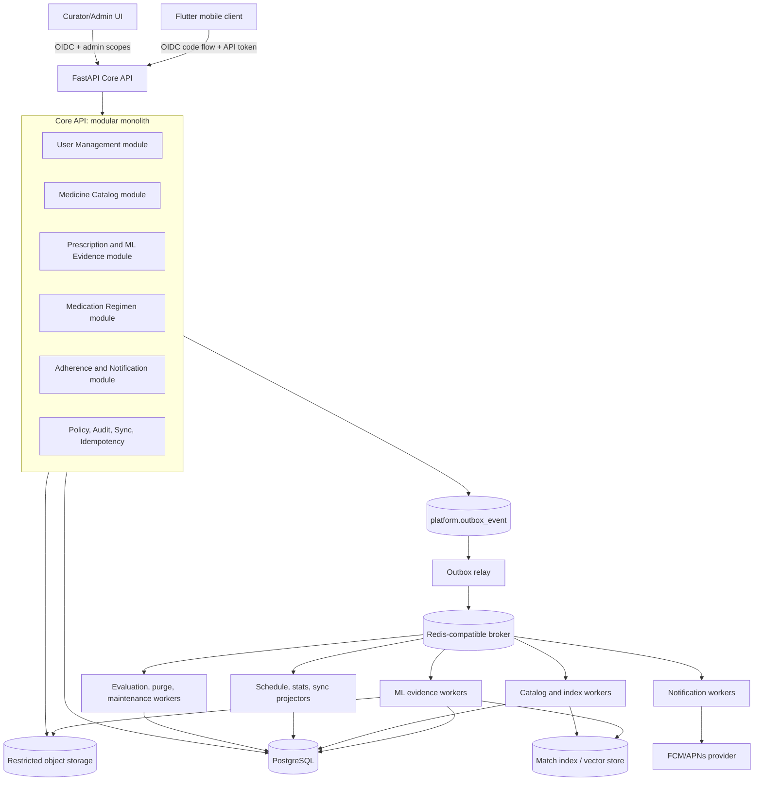

# Whole Backend System Architecture

## 1. Recommended deployment shape

Nirog should begin as a modular Python backend with clear process boundaries, rather than independently deployed microservices. The synchronous API handles authenticated user commands and read models. It stores business state and domain events in PostgreSQL. A transactional outbox relay publishes committed events to a broker; specialized workers execute work that must not lengthen an API request, including ML processing, catalog imports/index builds, notification delivery, schedule projection, sync compaction, purge execution, and evaluation runs.



## 2. Code and data ownership

| Module | Sync command owner | Primary tables/schema | Emits committed events | Receives events |
|---|---|---|---|---|
| User Management | account lifecycle, profile sharing, consent, preferences, device registration | `identity.*` | `profile.access_changed`, `device.updated`, `consent.changed` | none required for core ownership |
| Medicine Catalog | source import approval, curation, release publication | `catalog.*` | `catalog.release_published`, `catalog.index_requested` | curation feedback candidates |
| Prescription/ML Evidence | document creation, scan request, review decision | `prescription.*` | `scan.requested`, `review.confirmed` | catalog release publication, stage completion |
| Medication Regimen | create/version/stop regimen, inventory mutations | `regimen.*` | `regimen.changed`, `schedule.changed`, `inventory.changed` | review confirmed, dose/refill outcomes |
| Adherence/Notifications | append user dose event, acknowledge notification | `adherence.*` | `dose.recorded`, `notification.state_changed` | schedule/inventory changes |
| Platform | command de-duplication, outbox relay, audit, change feed, retention | `platform.*` | delivery/control events | all event families |

No module may write a foreign module’s business tables. A module must expose a command service or consume a versioned domain event. Direct SQL joins may be used only in explicit read-model/repository functions that apply the authorization policy and do not leak ownership.

## 3. Synchronous request boundary

An HTTP request is responsible for authenticating the account, resolving an active profile capability, validating input, applying a single domain command, persisting its business state and outbox event in one PostgreSQL transaction, and returning a resource representation or an accepted-job response. It must not call a vision model, send a push notification, rebuild an index, or wait for a catalog import. Those effects start from an outbox event after commit.

## 4. Event envelope

Every domain event uses a stable envelope. Consumers are idempotent and record the event identifier before producing an external side effect.

```json
{
  "eventId": "uuid",
  "eventType": "regimen.changed.v1",
  "aggregateType": "regimen_item",
  "aggregateId": "uuid",
  "aggregateVersion": 4,
  "profileId": "uuid",
  "occurredAt": "2026-08-18T00:00:00Z",
  "causationId": "client-command-or-event-id",
  "correlationId": "request-trace-id",
  "payloadVersion": 1,
  "payload": {}
}
```

`profileId` is omitted for catalog-wide events. Events must never carry raw prescription image bytes, access tokens, passwords, or full unredacted OCR output. Workers obtain restricted resources using service credentials and an event reference.

## 5. Reliability baseline

The transactional outbox prevents the dual-write failure in which a database change commits but the corresponding job/event is never published. The outbox row is written in the same transaction as the aggregate change; a relay later publishes it. Consumers must tolerate at-least-once delivery and preserve per-aggregate order using `aggregateVersion` and a consumer ledger.[1] [2]

## References

[1] [Transactional Outbox Pattern, Microservices.io](https://microservices.io/patterns/data/transactional-outbox.html)

[2] [Transactional Outbox Pattern, AWS Prescriptive Guidance](https://docs.aws.amazon.com/prescriptive-guidance/latest/cloud-design-patterns/transactional-outbox.html)
