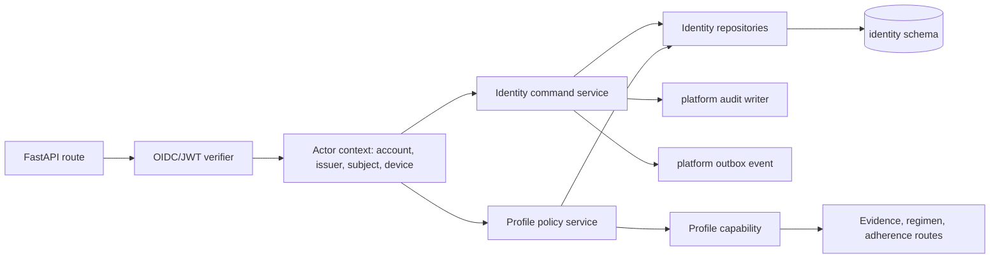
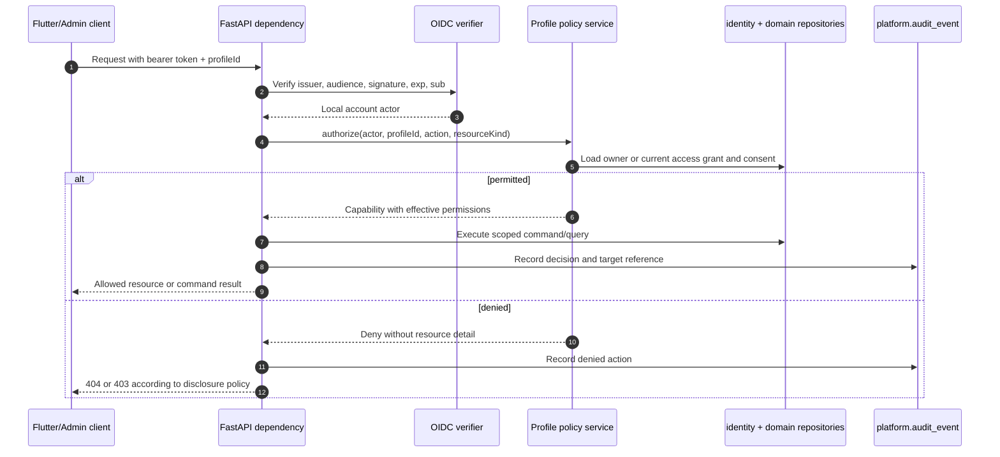

# User Management Technical Architecture

## 1. Scope and responsibility

User Management is the authoritative source for **who is acting**, **which patient profiles they may access**, **what they may do**, and **which device/preferences apply**. It does not own prescription documents, regimens, doses, catalog facts, or ML results. Other modules request an evaluated profile capability rather than interpreting team membership themselves.

## 2. Runtime module structure

The API verifies the OIDC issuer, audience, expiry, signature, and subject before mapping `(issuer, sub)` to `identity.auth_identities`. It uses the provider subject as the stable external link and a local UUID as the internal `account_id`. Tokens identify the actor; they do **not** grant a profile by embedding a mutable list of profile IDs or permissions.

## 3. Physical persistence design

The module uses PostgreSQL schema `identity`. All timestamps are `timestamptz`; IDs are UUIDv7 or UUID generated by the application. Soft deactivation uses `status` and `deleted_at`; sensitive account deletion creates a platform purge job rather than immediately breaking referential history.

| Table | Required columns | Keys and constraints | Notes |
|---|---|---|---|
| `identity.accounts` | `id`, `display_name`, `email_normalized`, `status`, `created_at`, `updated_at`, `deleted_at` | unique partial index on `email_normalized WHERE deleted_at IS NULL`; status check | Local account record, not credential store. |
| `identity.auth_identities` | `id`, `account_id`, `issuer`, `subject`, `provider`, `last_seen_at`, `created_at` | unique `(issuer, subject)`; FK account | Maps OIDC identity to local account. Never persist provider access/refresh tokens here. |
| `identity.account_preferences` | `account_id`, `language`, `timezone`, `snooze_minutes`, `notification_enabled`, `digest_enabled`, `updated_at` | PK `account_id`; timezone must be IANA value validated in app | One current record per account. |
| `identity.devices` | `id`, `account_id`, `installation_id`, `platform`, `push_token_ciphertext`, `push_state`, `last_seen_at`, `revoked_at` | unique `(account_id, installation_id)`; unique live push token hash | Device is a notification/sync principal, never a profile authority principal. |
| `identity.patient_profiles` | `id`, `owner_account_id`, `display_name`, `relationship_type`, `birth_date`, `status`, `created_at`, `archived_at` | FK owner; profile status check | Holds minimal identity data required for the medication context. |
| `identity.profile_access` | `id`, `profile_id`, `grantee_account_id`, `role`, `permission_set`, `consent_id`, `granted_at`, `effective_at`, `revoked_at`, `granted_by` | unique live `(profile_id, grantee_account_id)`; `effective_at < revoked_at` when set | This is the sole durable caregiver/profile authority grant. |
| `identity.teams` | `id`, `owner_account_id`, `display_name`, `status` | FK owner | Collaboration container only; membership alone does not grant profile access. |
| `identity.team_members` | `team_id`, `account_id`, `role`, `joined_at`, `removed_at` | unique live membership | May help group invitations but is not queried as health-data authority. |
| `identity.team_invitations` | `id`, `team_id`, `profile_id`, `email_normalized`, `role`, `permission_set`, `token_hash`, `expires_at`, `status`, `invited_by` | unique active invitation by `(team_id, email_normalized, profile_id)`; never store raw token | Acceptance creates a team membership plus explicit profile access in one transaction. |
| `identity.consents` | `id`, `profile_id`, `purpose`, `scope`, `state`, `granted_by`, `version`, `granted_at`, `withdrawn_at` | current consent uniqueness by purpose/scope | Separate sharing consent from research/learning consent. |

### 3.1 Permission model

`permission_set` is JSONB in the access grant but validates against a versioned application enum. The initial permissions are `profile.read`, `document.read_metadata`, `document.read_image`, `document.create`, `regimen.read`, `regimen.write`, `adherence.read`, `adherence.write`, `notification.manage`, and `share.manage`. Roles are templates that expand into permissions when a grant is created; authorization checks the persisted permission set so later role-template changes do not silently broaden historical access.

Owners receive an implicit non-revocable capability through `patient_profiles.owner_account_id`, evaluated by the same policy service. Caregivers require a live `profile_access` row. A break-glass role is excluded from the MVP; emergency access requires a separately authorized product and legal design.

## 4. Authorization evaluation

Every endpoint that consumes `profileId`, `documentId`, `regimenItemId`, `scanJobId`, or similar client-supplied IDs invokes the policy service before loading a resource. This addresses object-level authorization risk; comparing only a JWT account ID to a request parameter is insufficient for multi-profile caregiver access.[1]

The application policy service is the primary control. For high-risk profile-scoped tables, PostgreSQL Row-Level Security is a second control: a transaction-local setting such as `app.account_id` and `app.profile_id` is set only after token verification; RLS policy permits owner or active-grant rows. The database role used by the application must not have `BYPASSRLS`; migrations/admin batch roles remain separate. PostgreSQL defaults to deny when RLS is enabled with no matching policy.[2]

## 5. API contract additions

| Endpoint | Command/query | Preconditions | Result |
|---|---|---|---|
| `GET /v1/me` | current account and preferences | valid token | account summary; no patient data |
| `PATCH /v1/me/preferences` | update account preferences | body validated, `If-Match` version | current preferences |
| `POST /v1/devices` | register/rotate device | valid token, token ownership check | device summary |
| `GET /v1/profiles` | list visible profiles | valid token | scoped profile summaries and permissions |
| `POST /v1/profiles` | create profile | valid token | owner profile |
| `PATCH /v1/profiles/{profileId}` | edit profile | `profile.read` + owner/`profile.manage` | updated profile |
| `POST /v1/profiles/{profileId}/shares` | invite caregiver | `share.manage`, current sharing consent | invitation accepted/pending |
| `POST /v1/invitations/{id}/accept` | accept invitation | invitation token + authenticated account | membership and access grant |
| `DELETE /v1/profiles/{profileId}/access/{grantId}` | revoke caregiver grant | `share.manage` | revocation receipt |
| `POST /v1/profiles/{profileId}/consents` | grant/withdraw consent | owner or authorized proxy policy | versioned consent state |

All mutations require `Idempotency-Key`. `PATCH` commands use an entity version (`If-Match` or body `baseVersion`) to prevent a stale client from overwriting a revocation or preference update. Domain-specific `application/problem+json` errors distinguish validation, stale version, expired invitation, revoked capability, and prohibited action without leaking another profile’s existence.

## 6. Transaction and event behavior

Creating or revoking profile access writes the identity state, `platform.audit_event`, `platform.outbox_event`, and a `platform.change_event` in one transaction. Published events include `profile.access_granted.v1`, `profile.access_revoked.v1`, `profile.consent_changed.v1`, `device.registered.v1`, and `account.deletion_requested.v1`. Receiving modules should invalidate capability/read caches but must not copy the access grant into their own tables.

Invitation acceptance is atomic: validate hashed invitation token and expiry, bind invitee identity, create team membership if applicable, create `profile_access`, change invitation state, audit, and outbox. A retry with the same idempotency key returns the previously created grant; a second accepted action is harmless.

## 7. Security and test matrix

| Test class | Required assertion |
|---|---|
| Token validation | Wrong issuer, audience, signature, expired token, or unknown subject is denied before route logic. |
| BOLA regression | Changing every resource UUID to a different profile’s ID never returns or mutates that resource. |
| Grant lifecycle | A revoked or expired grant loses access immediately on the next request and from sync/change feeds. |
| Property-level control | A caregiver without `document.read_image` cannot obtain an image capability even with `document.read_metadata`. |
| Invitation replay | Used, expired, cancelled, or mismatched-email invitations cannot create a second grant. |
| RLS integration | Application role receives no rows when transaction profile context is absent or mismatched. |
| Audit coverage | Allow and deny decisions for sensitive commands emit redacted audit records. |

## References

[1] [OWASP API1:2023 Broken Object Level Authorization](https://owasp.org/API-Security/editions/2023/en/0xa1-broken-object-level-authorization/)

[2] [PostgreSQL Row Security Policies](https://www.postgresql.org/docs/current/ddl-rowsecurity.html)

[3] [OpenID Connect Core 1.0](https://openid.net/specs/openid-connect-core-1_0.html)
