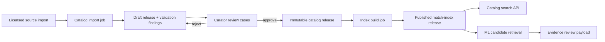
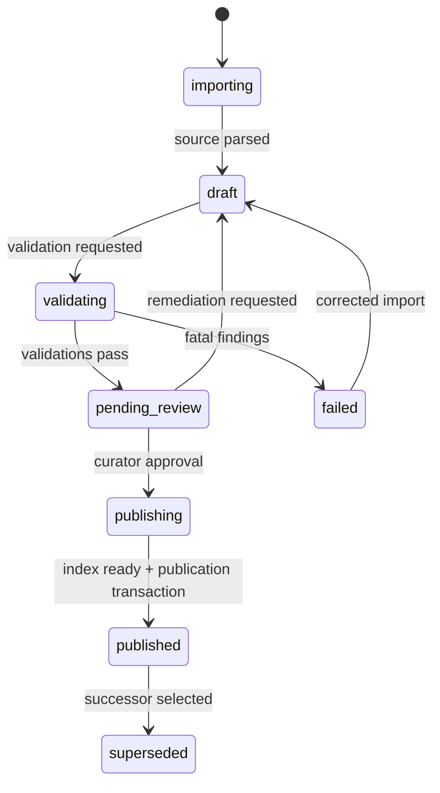

# Medicine Catalog Technical Architecture

## 1. Scope and aggregate model

The Medicine Catalog module owns shared, curated reference facts. It serves product lookup and match-candidate support to the ML Evidence module, but never stores a profile’s prescription, regimen, inventory, reminder, or dose event. A **catalog release** is the immutable unit of truth: every user-visible product response and every match candidate records the release that supplied it.

## 2. Release state machine

`catalog_release.status` transitions only forward: `importing → draft → validating → pending_review → publishing → published → superseded`. A failed import can become `failed`; a released catalog cannot be edited. Corrections create a successor release, with `supersedes_release_id` and release notes. The active release is a configuration pointer, not an in-place update.

## 3. Physical persistence design

All tables live in PostgreSQL schema `catalog`. Large source files are restricted assets; rows retain source checksum and normalized import facts. Product rows retain their release ID, so history remains resolvable even when a product is inactive in the current release.

| Table | Required columns | Keys/indexes | Invariants |
|---|---|---|---|
| `catalog.sources` | `id`, `publisher`, `license`, `source_uri`, `source_version`, `checksum`, `received_at` | unique `(publisher, source_version, checksum)` | A source claim is traceable and not overwritten. |
| `catalog.import_batches` | `id`, `source_id`, `release_id`, `status`, `finding_summary`, `started_at`, `completed_at` | index release/status | Import execution artifact, not catalog truth. |
| `catalog.releases` | `id`, `status`, `source_manifest`, `published_at`, `supersedes_release_id`, `release_notes` | one partial unique `status='published_current'` through config pointer | Published content immutable. |
| `catalog.manufacturers` | `id`, `release_id`, `name`, `normalized_name`, `status` | unique `(release_id, normalized_name)` | Product manufacturer belongs to same release. |
| `catalog.ingredients` | `id`, `release_id`, `coding_system`, `code`, `normalized_name`, `display_name` | unique `(release_id, coding_system, code)` when code available; normalized fallback | Ingredient identity is release-scoped. |
| `catalog.dosage_forms` | `id`, `release_id`, `code`, `display_name`, `route_compatibility` | unique `(release_id, code)` | Form/route compatibility is structured. |
| `catalog.products` | `id`, `release_id`, `brand_name`, `generic_display`, `strength_display`, `dosage_form_id`, `manufacturer_id`, `route`, `market`, `status` | release/name/form/strength index; GIN/trigram normalized fields | Product fact is catalog reference, not regimen. |
| `catalog.product_ingredients` | `product_id`, `ingredient_id`, `strength_value`, `strength_unit`, `ordinal` | PK `(product_id, ingredient_id, ordinal)` | Combination products retain each component. |
| `catalog.product_aliases` | `id`, `product_id`, `alias`, `normalized_alias`, `script`, `alias_type`, `source_case_id` | unique `(product_id, normalized_alias, script, alias_type)`; trigram index | Shared aliases are release-approved only. |
| `catalog.curation_cases` | `id`, `subject_kind`, `subject_id`, `proposed_change`, `evidence`, `state`, `created_by`, `reviewed_by`, `release_id` | state queue index | A user signal is not direct publication. |
| `catalog.index_releases` | `id`, `catalog_release_id`, `embedding_model`, `vector_config`, `checksum`, `state`, `built_at` | unique ready `(catalog_release_id, embedding_model, vector_config)` | Index points at one immutable release. |

`products` has a generated `search_text` constructed from normalized brand, generic, aliases, manufacturer, form, strength, and transliterations. Use GIN/trigram indexes for lexical retrieval. The semantic index stores only catalog content and a product/release reference; it must not embed prescription text, patient names, or raw OCR evidence.

## 4. Import and curation pipeline

1. A curator submits a source manifest. The API creates `import_batch` and emits `catalog.import_requested.v1`.
2. The import worker parses to staging tables, validates mandatory fields, normalizes names/units/scripts, detects duplicates, and produces structured findings.
3. A successful batch creates a `draft` release; validation findings and source rows are preserved.
4. Curators resolve cases. High-risk product changes may require two reviewers; the approval requirement is configurable by change class.
5. Publication freezes the draft content, creates an `index_requested` event, and only marks the release searchable when its compatible index release is ready.
6. The active-release pointer changes in a short transaction; an outbox event notifies evidence/search caches. In-flight scans retain their named catalog/index release.

## 5. API design

| Endpoint | Purpose | Access | Notes |
|---|---|---|---|
| `GET /v1/medicine-catalog/search?q=&strength=&dosageForm=` | User/manual-entry catalog search | authenticated, profile capability for return context only | Defaults to active release; response always includes `catalogReleaseId`. |
| `GET /v1/medicine-catalog/products/{productId}?releaseId=` | Resolve release-bound product details | authenticated | Reject product/release mismatch. |
| `POST /v1/admin/catalog/sources` | Register source manifest | catalog curator role | Upload uses restricted source asset capability. |
| `POST /v1/admin/catalog/imports` | Start source import | curator | Returns import job; async. |
| `GET /v1/admin/catalog/imports/{id}` | Import status/findings | curator | No patient data. |
| `POST /v1/admin/catalog/releases/{id}/publish` | Publish approved release | publisher role + optimistic version | Requires a ready compatible index. |
| `POST /v1/admin/catalog/curation-cases/{id}/decision` | Approve/reject/amend case | curator/reviewer policy | Creates release-bound change, never modifies published row. |

The internal ML retrieval call accepts parsed evidence (`normalized_name`, parsed strength, form, route, language/script hints), `catalog_release_id`, `match_index_release_id`, and a request correlation ID. It returns product IDs plus feature scores, compatibility flags, and release IDs. It does not receive account identity or raw document bytes.

## 6. Search and matching boundary

Lexical exact/fuzzy search, vector retrieval, and reranking produce candidates only. The catalog API applies **hard compatibility filters** before ranking: product is present in requested release, active/allowed status, form compatibility, route compatibility, and strength/ingredient constraints when evidence is available. Candidate score and rank are evidence, not a catalog mutation and not a regimen activation.

Cache only non-sensitive catalog search responses, keyed by `(active_release_id, normalized_query, filter_hash)`. Cache invalidation is release-event driven. A profile-private unresolved medicine is stored outside `catalog.*` and must never appear in global search until a curation case publishes a successor release.

## 7. Events, retries, and tests

| Event | Producer | Consumer | Idempotency key |
|---|---|---|---|
| `catalog.import_requested.v1` | Catalog API | import worker | import batch id |
| `catalog.import_validated.v1` | import worker | curation/read model | import batch id + validation revision |
| `catalog.index_requested.v1` | catalog publisher | index worker | release id + index configuration checksum |
| `catalog.index_ready.v1` | index worker | catalog publisher | index release id |
| `catalog.release_published.v1` | catalog publisher | ML evidence, search cache, audit | catalog release id |
| `catalog.curation_requested.v1` | evidence/user feedback adapter | curator queue | curation case id |

Required tests cover immutable published rows, duplicate source/import detection, component-strength preservation for combination products, alias provenance, index/release compatibility, publication rollback through successor release, global-search exclusion of private unresolved names, and ML retrieval filtering by release/form/route/strength.

## 8. Operational controls

Catalog imports and index builds run on dedicated queues. They use bounded concurrency, size limits, source checksums, task timeouts, retry only for transient failures, and DLQ/manual review for malformed sources. Published catalog/index artifacts have checksums and release notes. Metrics include import validation failure rate, curation age, index-build duration, search latency, candidate no-match rate, and result corrections by product/form/strength segment.

