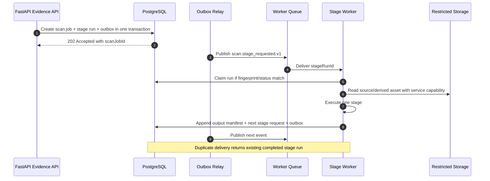

# ML Evidence Pipeline and Safety Architecture

## 1. Technical safety objective

The ML pipeline converts a profile-scoped prescription document into **reviewable evidence**. It is forbidden from writing `regimen.*`, `adherence.*`, or notification scheduling tables. Its terminal successful state is a persisted review payload with a policy outcome; only a separate, authenticated review command can create or version a medication regimen.

```mermaid
flowchart LR
  Upload[Document upload] --> Scan[Create scan job]
  Scan --> Ingest[Ingest worker]
  Ingest --> Prep[Preprocess worker]
  Prep --> OCR[Recognition worker]
  OCR --> Organize[Organization worker]
  Organize --> Extract[Structured extraction worker]
  Extract --> Retrieve[Catalog retrieval/rerank worker]
  Retrieve --> Policy[Review policy worker]
  Policy -->|ready_for_review| Payload[Immutable review payload]
  Policy -->|review_required| Payload
  Policy -->|manual_entry_recommended| Manual[Manual entry path]
  Payload --> UserDecision[Authenticated review command]
  UserDecision -->|confirmed only| Regimen[Regimen module command]
  UserDecision -->|edit/reject/unresolved| Evidence[Review decision record]
```



## 2. Scan job state and tables

`prescription.scan_jobs` is the aggregate. It holds a materialized status for client polling, while immutable rows retain every stage attempt.

| Table | Essential fields | Technical rule |
|---|---|---|
| `prescription.documents` | `id`, `profile_id`, `status`, `created_by`, `retention_class`, `document_version` | Profile is established by authorization at creation and never accepted from a worker payload. |
| `prescription.document_pages` | `id`, `document_id`, `position`, `asset_id`, `sha256`, `upload_state` | Source page is immutable; asset capability expires. |
| `prescription.scan_jobs` | `id`, `document_id`, `status`, `current_stage`, `input_fingerprint`, `idempotency_key`, `requested_by`, `created_at` | Unique idempotency scope `(requesting account, document, key)`; status changes use row lock/version. |
| `prescription.stage_runs` | `id`, `scan_job_id`, `stage`, `attempt`, `input_fingerprint`, `status`, `execution_manifest`, `raw_result_asset_id`, `parsed_result`, `error_code` | Unique `(scan_job_id, stage, input_fingerprint, attempt)`; append-only. |
| `prescription.extracted_lines` | `id`, `scan_job_id`, `page_id`, `region`, `raw_text`, `review_state` | Links raw evidence to every downstream field. |
| `prescription.field_candidates` | `id`, `line_id`, `field_kind`, `raw_value`, `normalized_value`, `validation_state`, `signal_set` | Normalization never overwrites raw text. |
| `prescription.match_candidates` | `id`, `line_id`, `catalog_release_id`, `index_release_id`, `product_id`, `rank`, `feature_scores`, `compatibility` | Candidate is release-bound and not accepted fact. |
| `prescription.review_payloads` | `id`, `scan_job_id`, `evidence_version`, `policy_release_id`, `outcome`, `payload`, `created_at` | Immutable UI contract for one evidence version. |
| `prescription.review_decisions` | `id`, `payload_id`, `line_id`, `actor_account_id`, `decision`, `edited_values`, `selected_product_id`, `outcome` | Explicit actor decision; updates create a superseding decision. |

The public scan status is one of `awaiting_upload`, `queued`, `processing`, `ready_for_review`, `review_required`, `manual_entry_recommended`, `failed`, or `cancelled`. A job may move from `processing` to `queued` only through a retryable stage failure and must record the failure reason in its stage run. No worker can set job status to an active therapy state.

## 3. Stage execution contract

Each worker receives `{stageRunId, scanJobId, documentId, expectedInputFingerprint, correlationId}`—not raw image bytes, client tokens, account email, or a trusted profile ID. The worker loads its permitted input through a service identity, verifies the expected fingerprint, writes only its stage-run output, and emits `scan.stage_completed.v1` or `scan.stage_failed.v1` through the outbox.



### 3.1 Input fingerprint

`input_fingerprint = SHA-256(canonical_json(stage inputs))` where stage inputs include parent artifact checksums, stage configuration, model/provider/revision, prompt/template revision, preprocessing revision, abbreviation release, schema version, catalog/index release, and policy release when relevant. A retry with unchanged material input increments `attempt`; changed material input creates a new stage run lineage. The mobile idempotency key is independent from stage execution lineage.

## 4. Trust zones and data minimization

| Zone | May access | Must not access | Control |
|---|---|---|---|
| Flutter client | its own upload capability and redacted job status/review payload | raw object-store keys, other profiles, worker credentials | short-lived upload URLs and profile authorization |
| Core API | profile/account policy, document metadata, resource references | model-provider secret material in client responses | service RBAC, audit, redaction |
| ML worker | stage references, restricted asset through service grant, de-identified processing context | end-user access token, caregiver/team details, unrelated profiles | workload identity, least-privilege asset access |
| External model provider, if chosen | minimum image/text input needed for that stage | catalog administration, user identity, permanent object URL | provider data agreement, encrypted transport, no provider logs containing identifiers, configurable retention |
| Catalog retrieval worker | normalized evidence fields and named release/index | raw image unless a separate stage requires it | release-scoped API and service credentials |

Raw OCR output and source crops are restricted health evidence. Telemetry stores identifiers, dimensions, model latency, token/cost aggregates, error class, and release IDs—not full prescription text or images. Worker queue payloads contain identifiers and checksums only; this limits message-broker exposure.

## 5. Enforceable review and activation gate

The only path to regimen creation is `POST /scan-jobs/{id}/review-decisions`. The command validates all of the following inside one transaction:

1. The caller currently holds `regimen.write` on the scan’s profile.
2. The scan is in a reviewable status and the submitted `evidenceVersion` equals the immutable review payload.
3. The selected product belongs to the payload’s catalog release and candidate set, or the request explicitly saves a private unresolved item.
4. Edited dose/timing fields satisfy schema and policy validation.
5. The decision key has not already been applied with different content.
6. A `review.confirmed.v1` event is written to the outbox only for an explicit confirm command.

The Regimen consumer verifies the review-decision ID, profile, evidence version, and policy findings before creating an initial `regimen_version`. It does not trust an ML event, candidate score, or client-supplied product ID by itself.

## 6. Policy engine and confidence treatment

The review policy is a versioned pure function over measured signals, not an LLM response. It receives image-quality score, recognition reliability, field validation state, candidate compatibility, calibrated match likelihood, rank margin, policy hard constraints, and configured coverage rules. It returns one of the approved review outcomes and machine-readable reasons.

```json
{
  "policyReleaseId": "uuid",
  "outcome": "review_required",
  "reasons": ["strength_ambiguous", "low_candidate_margin"],
  "display": {
    "allowPreselection": false,
    "requireDoseEdit": true,
    "allowManualEntry": true
  }
}
```

High match likelihood may allow a preselected candidate in the UI. It cannot skip the user decision. Any calibration/threshold change becomes a new `policy_release` with a linked evaluation run and rollout state.

## 7. Failure, retry, and manual path

| Failure class | Worker action | User-facing result | Retry policy |
|---|---|---|---|
| transient storage/model/network | mark attempt retryable, preserve error class, schedule backoff | processing/retry message | bounded exponential backoff with jitter |
| image corrupt/unsupported | terminal failed stage | explain supported retry or retake photo | no automatic retry |
| schema-invalid model output | reject output, preserve raw response reference | review required or manual entry | retry only if alternative parser/provider policy permits |
| catalog/index release unavailable | do not fabricate match | pending/retry or manual entry | retry after release availability |
| policy blocks interpretation | persist evidence and reasons | manual entry/review path | no automatic override |
| retry exhaustion | terminal stage failure + DLQ reference | retry later/manual entry | operator triage only |

Workers must be idempotent because task delivery may occur more than once. Celery explicitly recommends idempotent task functions and supports retry/backoff; any final runtime choice must provide equivalent semantics.[1]

## 8. Evaluation and release gate

The evaluation harness receives versioned test-set and annotation releases. Metrics include critical-field exact match, evidence-to-field alignment, false high-confidence preselection, calibration/coverage, manual-entry rate, correction rate by field and language/script, top-k compatible match recall, and stage latency/failure distribution. Character error rate is diagnostic only. A release record is required for any change to model, prompt, parser, preprocessing, abbreviation table, embedding, index, reranker, catalog release policy, or review policy.

## 9. Required negative tests

- A worker or queue message cannot write a regimen, planned dose, reminder, inventory, or notification row.
- A scan result with `ready_for_review` but no review decision cannot emit `review.confirmed`.
- A stale evidence version cannot create or modify a regimen.
- A candidate from another catalog/index release cannot be accepted without a new review payload.
- Raw OCR text cannot be sent to application logs, events, or change feeds.
- A duplicate stage delivery cannot produce a second external model request after a completed matching fingerprint.
- A private user correction cannot appear in shared catalog search without an approved curation case and published release.

## References

[1] [Celery Tasks: idempotence, acknowledgements, retries, and sensitive arguments](https://docs.celeryq.dev/en/stable/userguide/tasks.html)
