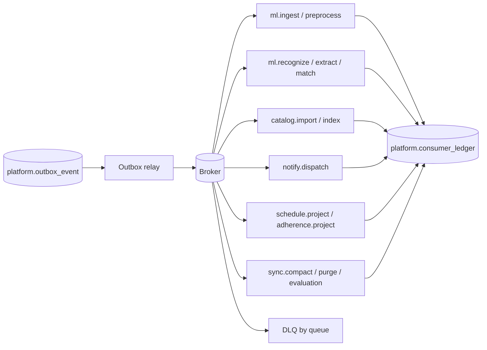
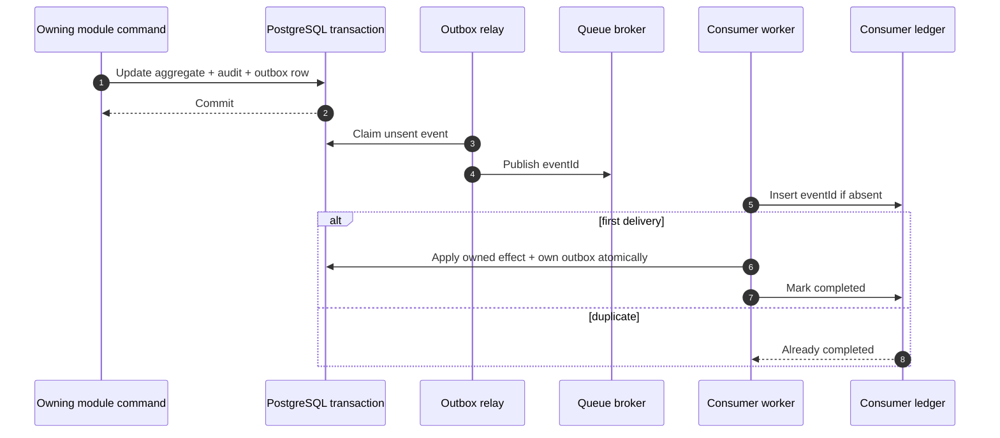

# Asynchronous Workers, Queues, and Reliability Architecture

## 1. Why work is asynchronous

Nirog’s API must complete profile-authorized commands quickly and atomically. Work that depends on model latency, remote providers, large imports, time-based delivery, bulk projection, or retention must run outside the request process. The asynchronous architecture is not a second source of domain truth: workers act on committed state and write results through the owning module’s controlled repositories.

## 2. Worker topology and routing

| Queue | Consumers | Payload reference | Concurrency/priority policy |
|---|---|---|---|
| `ml.ingest` | asset validation, page manifest generation | `scanJobId`, `stageRunId` | small CPU pool; high priority for interactive scans |
| `ml.preprocess` | image derivation/page split | stage reference and artifact ID | CPU/image pool; bounded memory |
| `ml.recognize` | vision/OCR inference adapter | stage reference only | dedicated GPU or provider-limited pool; strict timeout |
| `ml.extract-match` | organization, structured extraction, retrieval, policy | stage reference and named releases | low/medium CPU; rate limit provider calls |
| `catalog.import` | source parse/validation | import batch ID | low priority, isolated from scans |
| `catalog.index` | lexical/vector index build | catalog/index release ID | low priority; exclusive/limited per index |
| `notify.dispatch` | push/local notification hand-off, email if enabled | notification ID | rate limited by provider/device |
| `projection` | schedules, adherence stats, refill advisories, change feed | event ID/aggregate reference | high throughput, idempotent |
| `maintenance` | retention purge, audit export, evaluation, reconciliation | job ID/config release | low priority; scheduled windows |

Long-running recognition must never share worker slots with high-volume notification or projection tasks. Fair routing and per-queue limits prevent one supplier outage or GPU job backlog from starving user-facing schedule updates.

## 3. Transactional outbox and consumer ledger

Every domain write that requires work in another process inserts `platform.outbox_events` in the same transaction as the aggregate update. The relay claims unpublished rows using `FOR UPDATE SKIP LOCKED`, publishes the stable event envelope, and records broker publication metadata. If it crashes after publish but before marking delivery, the event may be delivered again; that is expected.

`platform.consumer_ledger` has unique `(consumer_name, event_id)`, status, started/completed timestamps, attempt count, error class, and output reference. A consumer reserves the event in a short transaction; it then processes it; it marks complete only after the owned state change is committed. Side-effecting provider calls use a provider idempotency key derived from notification ID or delivery attempt ID.

## 4. Task state and retry classification

| Failure category | Examples | Action | Retry/DLQ rule |
|---|---|---|---|
| transient | timeout, rate limit, broker disconnect, temporary storage/provider 5xx | preserve state, retry with exponential backoff and jitter | bounded attempts; route to DLQ after exhaustion |
| concurrency/stale version | aggregate/version changed while task waited | reload and re-evaluate idempotent desired state | retry once or no-op when superseded |
| permanent input | corrupt image, unsupported file, invalid import format | mark terminal result with safe error class | no retry; surface user/admin remediation |
| policy/authorization | revoked access, expired asset capability, disallowed release | stop processing, audit | no retry until explicit new command |
| deterministic processing | parser/schema output invalid, unknown task revision | preserve raw output and task context | no automatic retry unless alternate release is configured |
| capacity/cost | provider quota, GPU saturation, daily budget gate | defer or queue with visible pending state | bounded delay; notify operations on breach |

Each task has a hard timeout, a dependency-connect/read timeout, maximum attempts, maximum execution age, routing key, and retry budget. The chosen worker runtime may use Celery, but the design requirement is generic: at-least-once delivery, idempotent effect, explicit retry policy, safe sensitive-argument handling, and visibility into state.[1]

## 5. Dead-letter queues and operator recovery

Every primary queue has an associated DLQ. A DLQ record contains the event/task envelope, consumer name, attempts, error class, redacted diagnostic, source release/version, and correlation ID. It must not duplicate raw prescription bytes or access tokens. Operators may classify a DLQ entry as `requeue`, `cancel`, `superseded`, `manual_resolution`, or `bug`. Requeue creates a new attempt from the authoritative aggregate state; it never blindly republishes a stale payload after catalog/policy/profile access changes.

DLQ alerts use queue-specific thresholds based on rate and age, not a single absolute count. A stuck `ml.recognize` queue triggers a user-visible delayed state and manual-entry fallback; a stuck notification queue does not stop regimen updates; a stuck catalog index queue blocks release activation but does not invalidate the prior active release.

## 6. ML job orchestration

The ML pipeline is a directed stage graph, not one opaque task. A stage completion transaction verifies parent stage manifest and input fingerprint, writes the immutable stage result, decides the next stage, and emits exactly one request event for that next stage. `scanJobId + stage + inputFingerprint` determines desired work; `stageRunId` identifies a specific attempt.

Cancellation is cooperative. An API cancellation request marks `scan_job.cancel_requested_at`; workers check before non-reversible provider calls and before writing downstream requests. Completed evidence remains auditable according to retention policy, but cancelled work never creates a review payload or a regimen command.

## 7. Notification and schedule execution

`regimen.changed` and `schedule.changed` events cause a projector to recompute **future** planned doses from the current `regimen_version` and profile timezone. The projector does not alter historical planned doses or dose logs. It writes `regimen.planned_doses` and an outbox event for delivery scheduling.

The notification worker creates `adherence.notification_deliveries` with a deterministic delivery key `(planned_dose_id, channel, scheduled_for, revision)`. The worker dispatches to FCM/APNs using the provider’s collapse/idempotency facility where available and records attempted, accepted, failed, acknowledged, snoozed, or expired states. A provider acceptance is not proof that a user saw the reminder; it is delivery telemetry only.

Refill alerts are advisory. An inventory projection calculates `estimated_remaining` from user-recorded inventory movements and planned/confirmed dose semantics, then emits a refill-alert candidate. It cannot auto-order medication or infer an actual refill without a user record.

## 8. Offline synchronization and change feed

Mobile mutation commands include `{clientMutationId, deviceId, baseVersion, occurredAtClient}`. The platform idempotency table records `(accountId, clientMutationId)` with request hash and response reference. A repeat returns the original response; a same key with a different body returns conflict.

The server appends authorized resource changes to `platform.change_events` with monotonic per-profile sequence and resource version. `GET /v1/sync?cursor=` returns only resources visible under the caller’s current capability. A revocation increments an access epoch and causes the next sync to issue deletions/tombstones or require a full scoped resync. Clients never receive raw audit rows or internal outbox details.

## 9. Scheduled jobs

| Job | Trigger | Idempotent key | Safety rule |
|---|---|---|---|
| future-dose projection | regimen/schedule event and periodic reconciliation | profile + regimen version + projection window | no rewrite of historical dose meaning |
| overdue dose projection | periodic per timezone | planned dose ID + rule revision | projection only; does not assert non-adherence without policy |
| refill advisory | inventory/dose event and daily reconciliation | regimen item + inventory version + threshold | advisory only |
| catalog index verification | index event/maintenance window | index release checksum | prior active release stays active on failure |
| ML evaluation run | model/policy/release candidate | evaluation release ID | no automatic production promotion |
| retention/purge | policy schedule | resource + retention policy revision | legal/audit holds block deletion |

## 10. Observability requirements

Every asynchronous operation carries `correlationId`, `causationId`, `eventId`, `aggregateId`, worker task ID, queue, attempt, release/version identifiers, and redacted error category. Dashboards show queue age, lag, success/retry/DLQ rate, task duration percentiles, duplicate suppression, provider error rate, cost/budget use, and per-stage ML outcomes. Traces link the API command, outbox event, worker attempts, provider call, review payload, and confirmed regimen command without exposing protected text or images.

## References

[1] [Celery Tasks: idempotence, acknowledgements, retries, routing and logging](https://docs.celeryq.dev/en/stable/userguide/tasks.html)

[2] [Transactional Outbox Pattern, Microservices.io](https://microservices.io/patterns/data/transactional-outbox.html)
