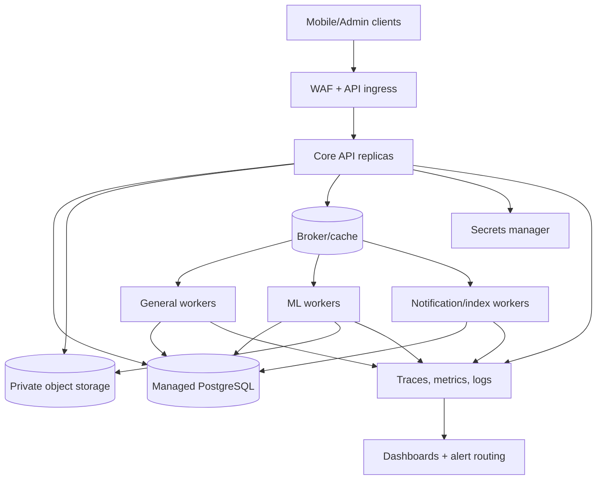

# Operations and Deployment Architecture

## 1. Environment topology

Nirog requires isolated `development`, `staging`, and `production` environments. Development may use synthetic or de-identified fixtures only. Staging uses an independently controlled database/object-store/broker and production-like integrations without production patient data. Production separates public ingress, core API, workers, storage, database, broker, and observability access through least-privilege service identities.

The ML worker pool is logically and operationally isolated because it handles expensive inference and potentially external model calls. Its service identity can read only stage-specific evidence references and write only prescription-stage results; it cannot access profile access grants, modify regimens, or send notifications.

## 2. Deployment units

| Unit | Scale signal | Required configuration | Failure containment |
|---|---|---|---|
| Core API | request concurrency/latency | OIDC keys, DB pool, feature flags, object capability signer | stateless replicas; no background jobs in request process |
| Outbox relay | unpublished event age | DB lease/batch size, broker credentials | multiple relays safe due claim/lease and consumer idempotency |
| General workers | projection/notification backlog | queue routing, retry policy, provider adapter config | separate queue pools |
| ML workers | scan queue age, GPU/provider quota | model/prompt/preprocess release, provider secrets, budget | isolation and manual-entry fallback |
| Catalog workers | import/index backlog | source policy, index config, curator release policy | cannot disrupt active catalog release |
| Scheduled maintenance | schedule/retention/evaluation lag | policy release, maintenance window | idempotent/restartable jobs |

## 3. Observability and service objectives

All request and worker spans use OpenTelemetry-compatible trace context. IDs link HTTP request, actor (redacted reference), profile reference, aggregate, outbox event, task, provider call, policy release, and resulting resource. Logs are structured and redacted; raw images, raw OCR text, secrets, access tokens, and full health payloads are prohibited.

| Signal | Initial operational question | Alert condition to tune during staging |
|---|---|---|
| Core API availability/latency | Can authorized users read/update essential medication data? | sustained error/latency breach against approved SLO |
| Scan stage age | Is a user waiting unusually long for reviewable result? | queue age or percentile stage duration crosses UX budget |
| ML review outcomes | Did uncertainty, manual entry, or failure increase? | material change by model/policy/catalog release segment |
| Outbox age | Are committed state changes not reaching workers? | oldest unpublished event beyond relay window |
| DLQ rate/age | Are tasks exhausting retry? | nonzero critical DLQ or growing age trend |
| Notification delivery | Are scheduled reminders being accepted by provider? | provider failure/rejection or backlog threshold |
| Catalog release health | Is active search index compatible with released catalog? | missing ready index, bad import/correction rate |
| Security | Are denials, token failures, or anomalous access patterns increasing? | threshold/behavioral policy breach |

Numeric SLO/SLA thresholds, on-call ownership, and pager routing require product and operating-capacity agreement. The technical design supplies the measurement points now so those commitments can be set later.

## 4. Release and change control

Application changes use backward-compatible schema migrations, API/event contract tests, security regression tests, and environment promotion. Catalog, ML, parser, prompt, embedding, index, and review-policy changes are separately versioned release artifacts. A deployment may introduce code that understands both old and new artifact versions; it must not silently reinterpret historical evidence.

| Change type | Required gate | Rollback behavior |
|---|---|---|
| API/schema | migration compatibility, contract tests, BOLA/RLS suite | code rollback; expand/contract migrations preserve compatibility |
| Worker behavior | idempotency/retry/DLQ tests, canary queue | route tasks to prior worker release; retain manifests |
| ML/prompt/parser/policy | held-out evaluation, segment review, false-high-confidence review, cost/latency check | restore prior release pointer; preserve new results with lineage |
| Catalog/index | source/case approval, index ready, search validation | restore active release pointer; do not mutate published rows |
| Notification adapter | provider sandbox/acceptance test | disable adapter/feature flag; never replay unbounded sends |

## 5. Backup, recovery, and retention

PostgreSQL uses point-in-time recovery, encrypted backups, restore drills, and access-controlled backup roles. Object storage uses versioning/lifecycle controls for restricted evidence; a database asset reference without an object and an object without a database retention policy are reconciliation alerts. Broker queues are not the system of record; authoritative events and task state live in PostgreSQL.

Retention policy is versioned by resource class. A deletion request begins a purge workflow: evaluate profile ownership/consent/legal hold, delete or cryptographically render inaccessible eligible assets, write purge audit outcome, issue sync tombstones, and preserve only the minimal audit record mandated by policy. Model/provider raw outputs follow the same restricted-evidence policy.

## 6. Incident runbook starters

| Incident | First action | Safe mitigation |
|---|---|---|
| OIDC provider unavailable | assess login/token verification cache and existing session policy | fail closed for new auth; do not weaken signature/issuer validation |
| ML provider/GPU backlog | inspect scan age, capacity, error category | route to manual entry/retry state; do not auto-accept stale candidates |
| Outbox relay stalled | inspect lease, DB connectivity, broker health | restart relay/reclaim expired lease; consumers dedupe duplicates |
| Catalog index failure | keep previous active release | block new release activation and requeue/rebuild index |
| Notification provider outage | record dispatch failure/retry class | avoid duplicate sends; surface in-app state and retry safely |
| Suspected authorization breach | revoke relevant access/session, preserve audit | pause affected endpoint/feature, investigate immutable audit events, notify per policy |

## 7. Capacity and cost governance

Capacity is measured separately for API, database, broker, object storage, notifications, catalog indexing, and ML inference. The API admission layer can limit scan creation per account/profile/device and can reject new noncritical scan work when the ML budget or queue age threshold is exceeded. Existing medication plans, dose logging, and manual entry remain available. This is a deliberate graceful-degradation rule: costly intelligence must not block essential user-recorded medication workflows.

