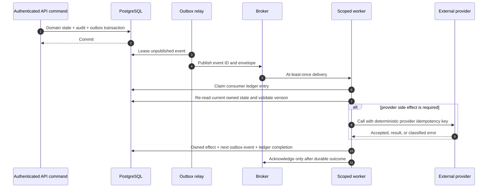
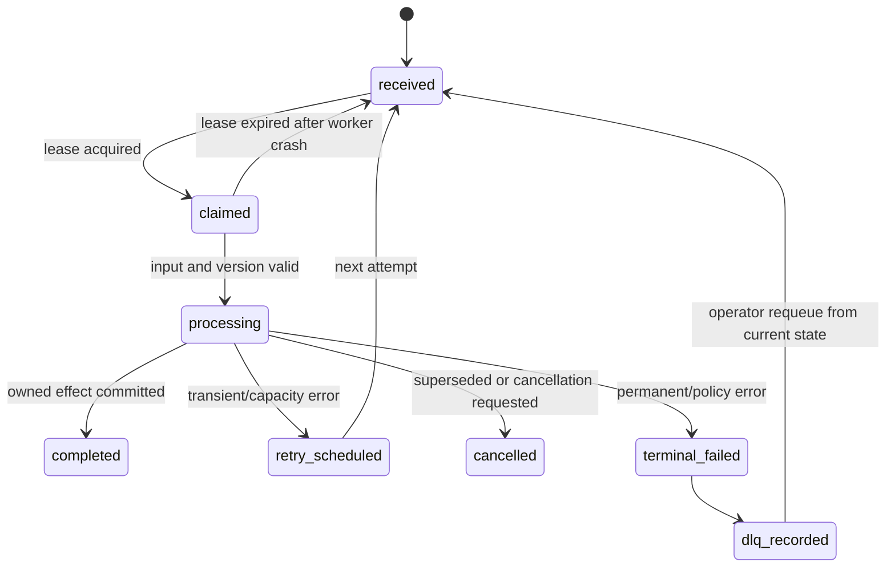
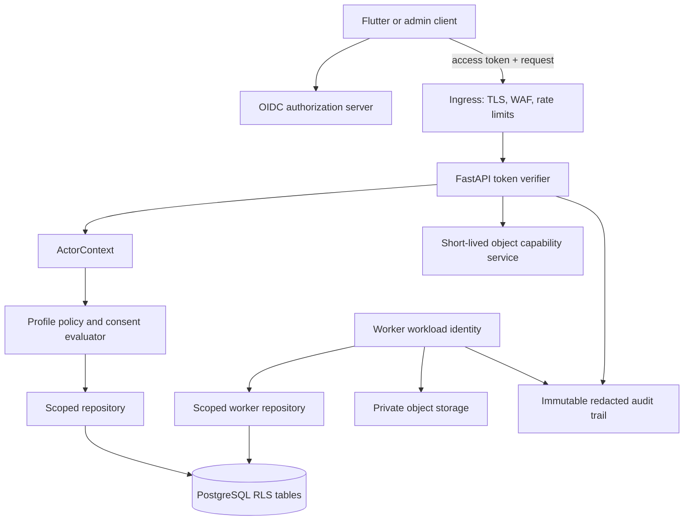

# Detailed Review: Asynchronous Failure Handling and Security Layers

## 1. Purpose and non-negotiable boundaries

This review converts the async, identity, and security decisions in the core technical analysis into implementation-level behavior. It does not introduce a second architecture. It makes the existing architecture operationally precise: PostgreSQL remains authoritative; the broker is a delivery mechanism; workers own only their module’s effects; and a user-confirmed review command is the only path from prescription evidence to a regimen.

Two principles govern all worker and security design. First, **at-least-once delivery is expected**, so every effect must be safely repeatable or deduplicated. Second, **identity must be established before policy**, so no bearer token, queue message, profile ID, or object UUID is treated as permission by itself.[1] [2]

## 2. The end-to-end asynchronous lifecycle

The synchronous API accepts an authenticated and authorized command, validates input, performs one module-owned state transition, and inserts an outbox row in the same database transaction. It returns the committed resource or a `202 Accepted` job reference. It does not wait for a broker, model, catalog index, push provider, or future schedule projection.

The outbox relay later claims the committed event with a lease, publishes the stable event envelope, and records publication metadata. A worker receives an identifier-only message, claims the event in the consumer ledger, loads current authoritative state, verifies the expected aggregate/stage version, performs its module-owned effect, and writes any next event through its own outbox transaction. The broker acknowledgement happens only after this durable outcome is decided.

### 2.1 Delivery guarantee by boundary

| Boundary | Realistic guarantee | Required control | Prohibited assumption |
|---|---|---|---|
| API command to PostgreSQL | atomic state, audit, idempotency response, and outbox record | one transaction | that publishing to a broker can join the transaction |
| Outbox relay to broker | at-least-once publication | lease/claim, durable event ID, safe duplicate publication | exactly-once event publication after relay crash |
| Broker to worker | at-least-once task delivery | consumer ledger and idempotent application effect | that a task executes once or in order across all aggregates |
| Worker to PostgreSQL | atomic owned state plus next outbox event | module-owned transaction and aggregate/version guard | cross-module direct table writes |
| Worker to external provider | provider-dependent at-most-once intent, then observable delivery state | deterministic idempotency key, delivery/request record, reconciliation | that network success proves a provider received or acted on a request |
| Worker to ML provider | reproducible stage attempt lineage | stage run, input fingerprint, model/provider release, raw-result reference | reusing output across changed input or model configuration |

The system should therefore describe its behavior as **effectively-once for owned state**, not exactly-once across the broker and every external provider. The consumer ledger protects PostgreSQL-owned effects. Deterministic provider keys and durable delivery records minimize duplicate external actions, but reconciliation remains necessary when a network outcome is unknown.[3]

## 3. Worker ownership, privileges, and queue isolation

Each worker process has a single workload identity, queue binding, database role, object-store policy, network egress policy, and configuration release. The runtime must not launch one all-powerful worker that can consume every queue and write every schema.

| Worker pool | Allowed inputs | Allowed writes | Explicitly denied | Operational priority |
|---|---|---|---|---|
| Outbox relay | `platform.outbox_events` | relay lease/publication fields only | business aggregate mutation | high; small stateless replicas |
| Evidence/ML stages | stage run ID, asset references, release manifest | `prescription.stage_runs`, evidence outputs, next stage request | `regimen.*`, `adherence.*`, notification delivery, profile access | isolated; bounded by provider/GPU quota |
| Catalog import/index | batch/release IDs, source artifacts | `catalog.*`, index release state | profile health data, patient assets | low/medium; cannot displace interactive scans |
| Projection/schedule | committed domain events | future planned doses, projections, change events | historical dose-log reinterpretation | high throughput and isolated from ML |
| Notification dispatch | notification/delivery ID | delivery attempt/outcome state | schedule creation, regimen mutation | provider-limited |
| Maintenance | named job and policy release | retention/reconciliation/evaluation records | broad profile reads unrelated to job scope | low priority and maintenance windows |

This separation is both capacity control and security control. ML saturation cannot consume schedule-worker slots, a catalog import cannot delay user-created scan jobs, and a compromised notification worker cannot create a medication plan. Queue routing must therefore be verified at deployment and in integration tests, not merely declared in configuration.

## 4. Failure classification and deterministic response

Failure handling begins by classifying the error before choosing a retry. A retry is appropriate only when the desired state is still valid and the dependency failure is plausibly temporary. Retrying a corrupt image, revoked permission, or stale catalog release wastes capacity and may replay a decision against the wrong state.

| Error class | Examples | Durable worker outcome | Retry behavior | User/operator outcome |
|---|---|---|---|---|
| Transient dependency | DNS issue, connection reset, provider `429`, storage/provider `5xx` | record redacted attempt error and next eligible time | bounded exponential backoff with full jitter; respect `Retry-After` | processing or delayed state; alert on sustained rate/age |
| Resource contention | row lock timeout, lease conflict, stale aggregate version | reload authoritative state | one short retry, then no-op if newer work supersedes it | no user error when desired state is already satisfied |
| Permanent input | corrupt image, unsupported MIME, invalid import schema | terminal stage/job outcome with safe machine reason | none | retake/reupload, correct import, or use manual entry |
| Policy/authorization | access revoked, consent withdrawn, expired object capability, restricted release | stop without accessing further data; audit policy denial | none until a new authorized command creates fresh work | safe denial or manual recovery flow |
| Deterministic code/config | parser contract invalid, unknown event revision, missing release manifest | freeze context and preserve a redacted diagnostic/reference | none by default; new release may create a new attempt | DLQ/operator investigation; do not spin |
| Capacity/cost | GPU saturation, model quota, daily budget, index capacity | defer work with explicit reason and expiry | delayed retry only within job-age/budget policy | visible wait/manual-entry fallback; capacity alert |
| Unknown external outcome | provider request may have succeeded before connection loss | mark `outcome_unknown`; persist deterministic provider key | reconcile by provider status if available; do not blindly resend | delivery/status remains pending until reconciled |

### 4.1 Retry budget and admission rules

Every task definition must contain six bounded controls: execution timeout, connect/read timeout, maximum attempts, maximum wall-clock age, retry budget, and queue-specific concurrency. Backoff uses jitter so a shared outage does not cause a synchronized retry spike. The task’s next attempt must be scheduled from durable state; a transient in-memory retry timer is not recovery-safe.

For interactive scan stages, the system should stop retrying when the job-age budget would no longer be useful to the user and transition to `manual_entry_recommended` or a visible delayed state. For notification delivery, the delivery’s expiration time is a hard ceiling: a reminder must never arrive substantially after its planned-dose window simply because a provider recovered late. For catalog indexing, retry can continue in an isolated low-priority lane, but the prior catalog/index release remains active.

### 4.2 The three critical crash windows

| Crash window | Expected behavior | Recovery proof |
|---|---|---|
| Database commits, relay has not published | outbox row remains unpublished | lease expiry permits another relay to publish it |
| Relay publishes, then crashes before marking publication | duplicate broker delivery is possible | consumer ledger suppresses duplicate owned effect |
| Worker calls provider, then crashes before persisting result | provider outcome is uncertain | deterministic provider key and provider-query/reconciliation decide whether to persist accepted, retry, or expire |

The final window is the reason a provider call cannot be “made exactly once” merely by acknowledging a broker message late. The system must persist intent before the call, use a stable provider idempotency key, and reconcile when the response is unknown. Notifications use a deterministic delivery key; ML stages use their `stageRunId` plus release/input fingerprint. If the chosen provider lacks idempotency or status lookup, its use must be restricted to effects that are safe to repeat or manually review.

## 5. Consumer-ledger and task state machine

The `platform.consumer_ledger` is not only a deduplication table. It is the durable task-control record. A worker first creates or claims `(consumer_name, event_id)` in a short transaction. The row includes `status`, `attempt`, `lease_expires_at`, `started_at`, `completed_at`, `error_class`, `output_reference`, and the expected aggregate/stage version.

Completion is written only in the same transaction as the worker’s own effect and any follow-on outbox event. A duplicate delivery that encounters `completed` returns without calling an external provider. A stale delivery that finds a newer aggregate or stage version becomes a no-op/superseded result rather than a retry storm. A lease expired during a long-running task requires a heartbeat/lease extension policy or a single-running-stage lock so a second worker does not duplicate expensive inference.

## 6. Dead-letter handling is a recovery workflow

Dead-letter queues are not storage for failed tasks. They are an operational workflow that preserves enough context to decide whether the correct response is **requeue, cancel, supersede, manual resolution, or defect remediation**. The DLQ entry stores the event/task envelope, task and correlation IDs, consumer, redacted error class, attempts, release versions, and links to authoritative task state. It stores neither raw prescription bytes nor tokens.

| DLQ decision | Preconditions | Action | Safety rule |
|---|---|---|---|
| Requeue | dependency/config issue resolved and desired state still current | create a new delivery attempt from the authoritative aggregate/stage | do not replay a stale serialized payload |
| Cancel | user cancellation, retention purge, or access revocation supersedes work | mark terminal/cancelled and release temporary artifacts | no downstream stage or notification is emitted |
| Supersede | newer aggregate/stage/release exists | record linkage to newer work | older work cannot overwrite newer state |
| Manual resolution | input/content needs human action | expose safe remediation to authorized user/operator | manual action has its own audit and idempotency key |
| Defect remediation | deterministic code/config fault | quarantine release, create incident, produce a new governed attempt after fix | never mass-replay without compatibility review |

DLQ alerts are queue-specific. A single failed catalog import may deserve ticketing; a nonzero sustained notification DLQ rate may be urgent; an ML queue backlog should trigger user-facing delay/manual-entry posture before it becomes a full outage. Operators need runbooks that name an owner, define an evidence query, identify a safe mitigation, and require a post-recovery reconciliation check.

## 7. Reconciliation and safe degradation

At least one scheduled reconciliation job exists for each external or derived effect. It compares the authoritative source state with derived state, fixes only the narrow missing/incorrect projection, and emits its own audit/outbox record. Examples include unpublished-outbox sweep, orphaned-consumer lease sweep, planned-dose projection verification, missing change-event repair, notification provider outcome reconciliation, asset/reference integrity checks, and catalog index checksum verification.

When ML capacity, a model provider, or an index is unavailable, the application remains usable for manual medication entry, existing regimen management, dose recording, and profile access. When the notification provider is unavailable, dispatch records remain pending/failed with deduplicated retries, but schedule and regimen state continue to update. When authorization is revoked, queue work stops at the next authorization-sensitive boundary and sync issues tombstones or a full scoped resynchronization. Graceful degradation keeps the highest-value record-keeping workflow available while never promoting uncertain automation into therapy.

## 8. Security and authentication architecture

Security is layered so one failed or misused mechanism does not become the sole barrier protecting profile-scoped health data. OIDC authenticates the account; server-side profile policy authorizes the requested action; repositories scope data; PostgreSQL RLS constrains accidental cross-profile access; workload identities constrain processes; private storage and short-lived capabilities constrain evidence access; audit and telemetry make decisions observable.

### 8.1 Authentication: establish who is acting

The Flutter client uses an OIDC authorization-code flow with PKCE. The app obtains an access token from the configured issuer and presents it to the Nirog API over TLS. The API validates issuer, audience, signature against the issuer’s key set, expiry, not-before, approved algorithm, and nonempty subject before it maps `(issuer, subject)` to the local account. OpenID Connect defines the identity claims and token-validation context; Nirog’s backend remains the authority for its own local account and profile policy.[4]

The API constructs an immutable `ActorContext` only after successful validation. It contains local `account_id`, issuer/subject reference, token/session identifiers, device/installation reference when independently registered, authentication context, correlation ID, and request source. It deliberately does **not** contain a mutable embedded list of profiles or permissions. A token tells the backend who is attempting an action; it does not authorize that action.

| Authentication control | Required behavior | Failure behavior |
|---|---|---|
| OIDC metadata/JWKS | cache issuer metadata and keys with controlled refresh; accept only configured issuer/audience/algorithm | unknown key may trigger bounded refresh; invalid token is denied |
| Token validation | verify cryptography and temporal claims before route logic | return generic unauthorized result; audit redacted reason |
| Subject mapping | map unique issuer + subject to local account | unknown/deactivated account cannot access profile data |
| Device registration | device is tied to authenticated account; push token encrypted and revocable | device has no inherent profile authority |
| Refresh/session policy | refresh token stays in the approved client/OIDC session flow, not in API domain tables | revoked/expired session requires reauthentication |
| API transport | TLS at ingress; HSTS and secure mobile networking configuration | reject insecure paths; do not downgrade transport |

### 8.2 Authorization: decide what this actor can do now

After authentication, the profile policy service evaluates the current request using `account_id`, target profile, action, resource kind, ownership, active `profile_access` grant, persisted permission set, consent state, time validity, and relevant resource relationship. The response is a short-lived evaluated capability for this request/transaction, not a stored client-side authority.

This distinction matters for caregivers. Team membership may support collaboration but is never enough to read health data. The durable grant is `identity.profile_access`, with a versioned permission set and consent linkage. A revocation takes effect on the next policy evaluation, invalidates scoped caches, emits an audit/outbox/change event, and prevents future sync access. Authorization checks occur before loading any resource identified by a client-supplied UUID to prevent broken object-level authorization.[2]

| Authorization layer | Decision enforced | Example |
|---|---|---|
| Route dependency | valid actor plus a declared action/profile | reject an unauthenticated `POST /profiles/{id}/scan-jobs` |
| Profile policy service | owner/grant/consent/permission/time | caregiver can read regimen but cannot read prescription image |
| Resource relation check | requested object belongs to authorized profile and valid aggregate state | scan job cannot be read by replacing its UUID with another profile’s UUID |
| Command/domain policy | transition is valid for current actor and aggregate version | only `regimen.write` actor can confirm reviewed evidence |
| Repository scoping | query includes authorized profile/domain relationship | list and lookup queries cannot broaden across profiles |
| PostgreSQL RLS | second database-level profile fence | query returns no profile rows when transaction context is absent/mismatched |

`404` versus `403` is selected by an explicit disclosure policy. For existence-sensitive profile resources, return a safe non-disclosing response; for a known current-profile action with insufficient permission, return a clear forbidden response. Both outcomes generate redacted audit records.

### 8.3 Database RLS and application roles

PostgreSQL RLS is defense in depth, not the primary authorization engine. The API or worker sets transaction-local account/profile context only after its own policy evaluation. RLS policies allow the application database role to access rows only when that context and the row’s profile relationship match. The normal application role must not own protected tables and must not have `BYPASSRLS`; separate migration/admin roles are tightly controlled. PostgreSQL notes that table owners and roles with `BYPASSRLS` can bypass row-security policy, which is why role separation is mandatory.[5]

Workers never inherit an end-user session. A worker uses a scoped service role with only the narrow query/update permissions needed for its task. Evidence workers, for example, load a stage run and associated asset through a service grant, validate its fingerprint, and write stage output only. They do not receive bearer tokens, caregiver details, broad profile search privileges, or rights to regimen/adherence tables.

### 8.4 Restricted evidence and object-storage access

Prescription images, OCR crops, raw model output, and raw OCR text are restricted evidence. Object storage has no public bucket or permanent public URL. The API grants a short-lived, purpose-bound upload or download capability after the actor and profile policy succeed. Completion checks expected content type, byte size, checksum, malware/format validation, and document state before the asset is attached to a document page.

Workers receive object references, not user-issued URLs. The worker identity obtains the specific asset it needs, for the permitted stage, during a narrow execution window. Queue envelopes contain identifiers, checksums, trace IDs, and release IDs only. They never carry source bytes, access tokens, passwords, raw OCR content, or broad signed URLs.

### 8.5 Secret, network, and provider protection

Secrets are provided at runtime by a managed secret system, scoped by workload, rotated, and excluded from code, logs, audit payloads, database records, and queue messages. Network policies allow each workload only the services it needs: API-to-database/broker/storage/identity services; ML worker-to-approved model/provider and restricted storage; notification worker-to-approved push provider; and no implicit lateral access among workers.

External adapters enforce typed request/response schemas, timeout and circuit-breaker policy, provider idempotency behavior, allowed outbound data fields, provider/version tags, and telemetry redaction. If an external ML provider is selected, its data processing, retention, regional handling, and logging commitments must be approved before any restricted evidence leaves Nirog’s trust boundary.

### 8.6 Audit, monitoring, and incident containment

The platform writes append-only redacted audit events for sensitive allow/deny decisions, profile sharing, consent change, document capability issuance, review confirmation, schedule/notification state change, data purge, and administrative release action. Logs and traces use correlation IDs and redacted references; they do not record raw prescriptions, full health payloads, secrets, or access tokens.

Potential security events have specific containment actions. Token verification anomaly causes issuer/key configuration review and safe authentication denial. Suspected profile-access breach causes relevant session/grant/device revocation, preservation of audit evidence, endpoint/feature restriction when needed, and policy-led notification. A compromised provider credential causes secret rotation, egress restriction, adapter disablement, and review of scoped provider request records. Security response must never weaken issuer/signature verification, expand worker permissions, or expose restricted evidence to diagnose an incident.

## 9. Required verification matrix

| Area | Minimum automated proof |
|---|---|
| Outbox crash window | committed aggregate without published event is relayed after restart; post-publish duplicate produces one owned effect |
| Consumer deduplication | duplicate event/stage request results in one ledger completion and one downstream request/provider intent |
| Retry classification | transient errors back off; revoked, corrupt, stale, and schema-invalid inputs do not loop |
| Provider uncertainty | post-call crash follows provider-key reconciliation rather than unbounded resend |
| DLQ recovery | requeue loads current authoritative state; stale payload cannot overwrite a newer release/version |
| Worker least privilege | ML task cannot read unrelated profile assets or mutate regimen/adherence/notification tables |
| OIDC validation | wrong issuer, audience, signature, algorithm, expiry, or subject mapping fails before route logic |
| BOLA prevention | replacing any profile-scoped UUID with another profile’s UUID returns no data and performs no mutation |
| Grant/consent revocation | next API request, capability request, and sync feed reflect revocation; queued sensitive work is cancelled/superseded |
| RLS integration | application role receives no protected rows with absent/mismatched transaction context |
| Evidence confidentiality | raw OCR/image bytes never appear in API logs, event envelopes, DLQ payloads, or tracing attributes |

## References

[1] [Transactional Outbox Pattern, Microservices.io](https://microservices.io/patterns/data/transactional-outbox.html)

[2] [OWASP API1:2023 — Broken Object Level Authorization](https://owasp.org/API-Security/editions/2023/en/0xa1-broken-object-level-authorization/)

[3] [Celery Tasks: idempotence, acknowledgements, retries, routing, and logging](https://docs.celeryq.dev/en/stable/userguide/tasks.html)

[4] [OpenID Connect Core 1.0](https://openid.net/specs/openid-connect-core-1_0.html)

[5] [PostgreSQL Row Security Policies](https://www.postgresql.org/docs/current/ddl-rowsecurity.html)
