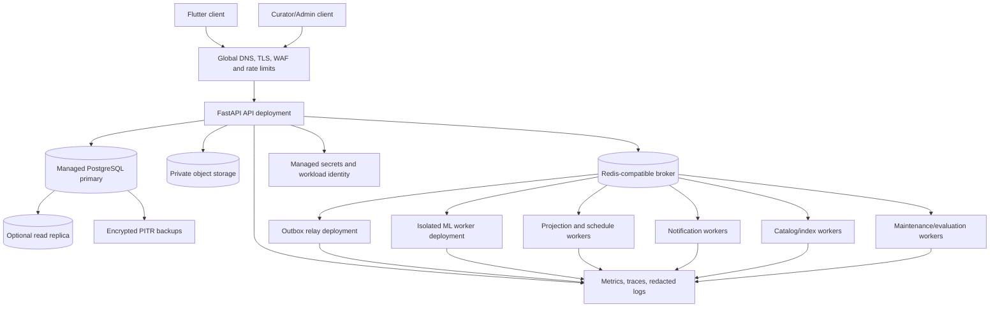

# Deployment and Scaling Guide

## 1. Purpose and operating model

This guide translates the Nirog technical architecture into a production deployment plan. It assumes the documented modular FastAPI backend, PostgreSQL as the authoritative record, a Redis-compatible broker, private object storage, and independently deployed worker processes. It remains cloud-neutral: a managed container platform or Kubernetes can host the workloads, but the safety and scaling controls in this guide do not depend on a particular vendor.

Nirog should scale by **workload class**, not by splitting every module into a network service. The core API, outbox relay, worker pools, database, broker, object storage, and observability stack have different demand signals, identities, failure modes, and recovery procedures. They are therefore deployed and scaled separately while continuing to use clear module ownership inside the same backend codebase.

> **Deployment rule:** Scaling must never weaken the core safety boundary. In particular, adding ML capacity cannot grant ML workers permission to create regimens, schedules, adherence events, reminders, or profile-access changes.

## 2. Target production topology



The public ingress is the only internet-facing application boundary. PostgreSQL, broker, object storage control plane, worker endpoints, internal telemetry, and secret systems are private. The API and each worker pool use distinct workload identities and receive only the credentials and network access required for their documented responsibility.

## 3. Environment and account separation

Development, staging, and production are independently controlled environments. The separation includes database cluster, broker, object-storage namespace, identity-provider client/application, encryption keys, secret store paths, push-provider configuration, telemetry destination, and cloud account/project where the platform supports it. Development uses synthetic or de-identified fixtures only. Staging exercises production-like topology and integration behavior without production profile/evidence data.

| Environment | Main purpose | Data rule | Deployment rule | External provider rule |
|---|---|---|---|---|
| Development | local implementation, unit/integration tests | synthetic fixtures only | rapid but reviewable CI deployment | sandbox/mock credentials by default |
| Staging | integration, migration rehearsal, scale and release checks | synthetic/de-identified data | production-like build artifact and infrastructure | sandbox or isolated provider projects |
| Production | approved user workflows | real data with documented classification/retention controls | protected promotion from validated artifact | scoped production credentials, usage/cost monitoring |

Environment separation prevents test jobs, index experiments, parser changes, and credentials from becoming an unreviewed production path. Build once and promote the same immutable container/image digest through staging to production, changing only environment-specific configuration and secrets.

## 4. Deployment units and resource contracts

Every deployment unit declares its image digest, configuration release, service identity, allowed queues, database role, network egress, minimum/maximum replicas, resource request/limit, health check, startup condition, and dashboard ownership. Health checks report local readiness only; an API should not become unready merely because an optional ML provider is unavailable.

| Deployment unit | Primary responsibility | Scale signal | Baseline health/readiness rule | Blast-radius boundary |
|---|---|---|---|---|
| API | authenticated commands and queries | request concurrency, latency, CPU, DB pool wait | can reach DB and required identity verification material; does not run long work | stateless API failure never mutates async state |
| Outbox relay | committed event publication | oldest unpublished event age, relay lease backlog | can query/claim outbox and connect to broker | duplicate publish is safe; business writes are denied |
| ML ingest/preprocess | asset validation and derivatives | queue age/depth, CPU/memory utilization | required storage access and stage configuration available | limited to evidence-stage tables/assets |
| ML recognize/extract/match | inference and reviewable evidence | queue age, provider quota, GPU utilization/cost | model/provider probe and release manifest valid | isolated from schedules/notifications/regimens |
| Projection/schedule | future doses, adherence/refill projections, sync feed | event lag and task duration | database access and event schema compatible | derived data only; preserves historical semantics |
| Notification dispatch | provider hand-off and delivery state | scheduled-due backlog, provider rate-limit state | provider credential/config present | cannot edit schedules/regimens |
| Catalog/import/index | source validation and release-index construction | import/index queue age, index build state | catalog source/release config present | prior active catalog remains usable |
| Maintenance/evaluation | retention, reconciliation, audit export, model evaluation | job schedule lag and workload budget | policy/config release loaded | maintenance window and task-specific scopes |

Container request and limit values must be benchmarked from representative staging workloads. Initial values are not permanent production facts; store them as reviewed deployment configuration with a test date, representative workload, and owner. A worker with a memory-sensitive image-processing stage, for example, should have bounded concurrency derived from measured per-task peak memory rather than generic CPU scaling.

## 5. Scaling policy by workload class

Autoscaling should react to both **demand** and **latency age**. Queue depth alone can hide a small number of old, user-visible scan jobs, while CPU alone can miss broker backlog caused by a rate-limited provider. Kubernetes’ Horizontal Pod Autoscaler supports scaling from resource and custom metrics; a queue-aware scaler or controller can supply queue age/depth, provider quota, and task-duration signals.[1]

### 5.1 API scale policy

The API is horizontally scalable because requests are stateless after authentication. It scales on a combined signal of active request concurrency or latency, CPU, memory pressure, and database-pool wait time. The database connection budget is a hard input to the maximum API replicas: do not add replicas until each replica’s pool size, service accounts, connection proxy, and database `max_connections` allocation are reconciled.

| API condition | Scaling response | Guardrail |
|---|---|---|
| Sustained latency or concurrency above the approved operating band | add API replicas gradually | cap replicas by DB connection and downstream identity-service budget |
| High CPU with normal latency | inspect serialization, validation, compression, or hot endpoint | do not scale indefinitely over an inefficient endpoint |
| DB pool wait increases | pause API scale-out; investigate query/index/pool pressure | shed nonessential scan initiation before degrading medication reads/writes |
| Optional provider outage | keep API available for core records | return accepted/pending/manual fallback instead of waiting synchronously |

The API deployment uses readiness, liveness, and graceful-termination behavior. On shutdown, stop accepting new connections, allow in-flight requests a bounded grace period, and rely on idempotency keys for client retries. It must never acknowledge an externally visible command before the command transaction is committed.

### 5.2 Worker scale policy

Workers scale independently by queue. One high-scale worker pool must not subscribe to unrelated queues “for flexibility,” because that defeats quota control and mixes high-risk permissions. The desired number of replicas is based on backlog age, arrival rate, measured service time, target completion time, and allowed concurrency per replica.

The basic planning relationship is:

```text
required parallelism ≈ (arrival_rate × average_service_time) / target_utilization
```

This is a planning estimate, not a replacement for queue-age monitoring. Use recent percentile service times and a utilization target below saturation so the system has burst and retry headroom. Longer stages such as OCR/vision inference use stricter concurrency ceilings than short projections; external provider rate limits and monthly/daily budget constraints can reduce desired parallelism even when backlog grows.

| Queue family | Primary trigger | Secondary guardrails | Degradation path |
|---|---|---|---|
| `ml.ingest`, `ml.preprocess` | oldest runnable job age | CPU/memory peak, object-store throughput | queue while preserving document; prompt retry/manual entry after job-age budget |
| `ml.recognize`, `ml.extract-match` | scan review wait age | provider quota, GPU saturation, inference cost, release health | throttle new noncritical scans; show delayed/manual-entry state |
| `projection` | event lag and time-to-project future doses | DB write pressure, per-profile ordering | increase replicas/partitions; protect historical dose meaning |
| `notify.dispatch` | due notification backlog | provider rate limit, expiry window, duplicate-suppression rate | bounded retry; expire late reminders; keep schedule state current |
| `catalog.import`, `catalog.index` | release build lag | index resource budget, curator release status | continue with prior active release |
| `maintenance` | scheduled-job age | maintenance window, DB/object-store budget | postpone noncritical work; never skip retention/legal-hold checks |

### 5.3 Database, broker, object storage, and index scaling

PostgreSQL is the primary integrity and concurrency boundary. Optimize schema/indexes and query shape first; then use a connection pooler/proxy, read replicas for explicitly safe read models, storage/IO scaling, and finally vertical/partitioning decisions based on measured workload. Transactional commands, authorization policy, outbox inserts, and current regimen reads remain primary-consistent. A replica must not be used for a read whose staleness could misstate a just-confirmed review, a revoked grant, or a current schedule.

PostgreSQL streaming replication is asynchronous by default; a replica can lag and replication configuration requires an explicit durability/availability trade-off.[2] That is why Nirog treats replicas as an optional read-scale mechanism, not as a source of record or an authorization decision source.

The broker is sized for durable task throughput, consumer lag, redelivery, and failover behavior, not as a database. It holds no exclusive business truth. Object storage scales independently but must expose quota, object count, upload failure, checksum-validation, and lifecycle metrics. The catalog match index/vector store is a release artifact: index scale-out or rebuild happens off the active pointer, and activation occurs only after readiness validation.

## 6. Scale-down and backpressure

Scale-down must be as deliberate as scale-up. A worker receives a termination signal, stops claiming new work, extends or releases its active lease according to a bounded drain policy, finishes only work that can complete safely within the grace period, and leaves uncompleted work eligible for redelivery. It does not acknowledge a message before its owned transaction commits. Long inference work either uses a checkpoint/cancel policy or remains above a minimum replica count during active demand windows.

Backpressure is applied at the admission boundary and queue boundary. When scan demand exceeds ML capacity, the API rate-limits or defers new noncritical scan creation by account/profile/device, returns an explicit accepted/delayed state, and keeps manual medication entry available. When PostgreSQL is under write pressure, pause nonessential imports, evaluation, and backfill tasks before restricting profile access, current regimen reading, or user-entered dose logging. This priority preserves the medication-management core while bounded automation recovers.

## 7. Safe release and migration procedure

Every application, worker, catalog, model, parser, prompt, index, and policy release is versioned. A deployment artifact records its immutable image digest, code revision, configuration release, database migration compatibility range, accepted event versions, worker queue bindings, and supported model/catalog/policy manifests.

### 7.1 Database change: expand, migrate, contract

Schema migrations use an expand/migrate/contract sequence. First, add compatible schema/table/index structures without removing the old path. Second, deploy code that reads old and new representations or writes both where necessary. Third, backfill with an idempotent, rate-limited worker and reconcile. Finally, after all supported readers and queued events have moved beyond the compatibility window, remove the deprecated structure in a separate approved change. PostgreSQL’s concurrent-index options and migration operational details should be chosen per version and tested in staging, because some DDL operations have different lock/transaction behavior.[3]

| Release step | Required proof | Rollback action |
|---|---|---|
| Build | unit, contract, authorization, and migration compatibility tests pass | discard artifact before promotion |
| Staging deploy | probes, synthetic workflow, migration rehearsal, queue/worker compatibility pass | rollback code; retain compatible expand schema |
| Production canary | bounded traffic or selected worker partition completes with expected metrics | route traffic/tasks to prior artifact; keep data compatibility |
| Gradual rollout | error, latency, queue age, correctness, and security signals remain within approved band | halt rollout and contain only affected unit/feature |
| Contract step | no old readers/events/data remain; backup/recovery window satisfied | postpone removal; never restore by destructive hotfix |

### 7.2 Worker and policy release

Workers are deployed with backward-compatible event consumers before event producers emit a new schema version. A new worker behavior begins with a canary queue, routing key, or bounded partition of noncritical work. For ML, parser, prompt, catalog, index, and review-policy changes, run an evaluation release first, compare the approved quality/safety/cost/latency measures, and activate by release pointer. Historical evidence remains attached to the release that produced it; rollback changes the active pointer for future work rather than rewriting history.

Feature flags are configuration, not an authorization bypass. They can disable a provider, stop new scan submission, limit a rollout cohort, or select a valid release, but cannot allow ML workers to bypass review confirmation or expand profile permission.

## 8. Operational readiness, monitoring, and alerting

All workloads propagate a correlation ID through request, outbox event, worker attempt, provider request, review payload, and user-confirmed command. Metrics use low-cardinality labels such as workload, queue, event type, error class, release ID, and environment. They never label raw prescription text, account email, full profile identifier, access token, or unbounded device ID.

| Area | Dashboard measures | Action trigger |
|---|---|---|
| API | availability, response latency, error code class, request concurrency, DB pool wait | sustained core workflow latency/error breach |
| Outbox | oldest unpublished event, lease count, publish attempts/failures | event age exceeds relay objective or relay crash loop |
| Workers | queue age/depth, active tasks, task duration percentiles, retry/DLQ rate, duplicate suppression | user-visible delay, repeated task exhaustion, or stuck lease |
| ML | stage age, review outcome mix, manual-entry rate, provider quota/cost, release distribution | shifted quality/safety outcome, quota exhaustion, or high false-preselection signal |
| Notifications | due backlog, provider acceptance/failure, expiry count, delivery deduplication | reminders becoming late, rejected, or repeated |
| Database | primary latency, connection utilization, lock/wait time, replication lag, storage/backup health | integrity/availability risk or unsuitable read-replica lag |
| Security | token failure class, policy denials, capability issuance, anomalous access rate, secret expiry | suspected authorization anomaly, credential risk, or misuse trend |

Numeric SLOs, alert thresholds, escalation rotation, and cost ceilings must be agreed from staging baselines and product commitments. Record them in environment configuration and runbooks once set; avoid embedding unexplained constants in worker code.

## 9. Backup, disaster recovery, and restoration drills

PostgreSQL receives encrypted backups and point-in-time recovery configuration. Object storage uses versioning and lifecycle rules aligned to evidence retention. The broker is not a recovery source of record: after recovery, the database state, outbox, task ledgers, audit events, and release manifests are authoritative. A restoration procedure rebuilds derived queues/indexes/projections from those sources instead of trusting stale broker messages.

| Recovery scenario | Recovery source | Safe restoration sequence |
|---|---|---|
| API deployment failure | prior immutable application artifact | stop rollout, route ingress to prior healthy revision, verify no incompatible migration/feature remains active |
| Worker release failure | prior worker artifact and current DB state | stop new claims for affected queue, route to prior compatible worker, drain/reconcile stuck leases and DLQ entries |
| Broker outage | PostgreSQL outbox and consumer/task state | restore broker, restart relay, publish committed events, rely on idempotent consumers |
| Database loss/corruption | encrypted backup + point-in-time recovery | restore isolated cluster, validate integrity/audit/release state, rebuild derived work before reopening writes |
| Object-storage incident | versioned private object storage + asset metadata | restore/validate object-reference checksums; block evidence-dependent stages until reconciled |
| Region/platform outage | documented multi-region/backup strategy selected by service objective | declare incident, restore approved critical scope, preserve audit and retention controls |

Recovery is a tested capability, not a backup setting. At a planned interval, perform a non-production restore drill with a measured recovery-time and data-recovery result, validate application migrations and object-reference reconciliation, and exercise the decision to rebuild derived projections/indexes. The outcomes determine whether the agreed recovery targets are achievable.

## 10. Capacity review cadence and implementation checklist

Capacity governance runs before major launch, at a regular operating cadence, and before new model/provider/catalog functionality is widened. It reviews arrival rate, queue age, API latency, database load, object-store growth, external-provider quota/cost, delivery performance, release outcome mix, and manual fallback usage. Product behavior changes such as adding languages, document types, notification channels, caregiver features, or batch catalog sources trigger a new scale and security review.

| Implementation checkpoint | Completion evidence |
|---|---|
| Workload manifests | distinct identities, queue bindings, DB roles, egress policies, probes, resource budgets, and replica bounds are committed/reviewed |
| Configuration/secrets | immutable config release; environment-scoped secret injection; rotation and expiry alerts; no secret in image/repository/log |
| Autoscaling | API and each worker family have defined signal, minimum/maximum, stabilization, scale-down drain, and overload behavior |
| Database safety | migration compatibility test, connection budget, backup/PITR validation, replication/read-consistency rules, restore drill result |
| Queue safety | outbox/retry/DLQ/reconciliation tests, stable event compatibility, queue isolation, and provider idempotency behavior validated |
| Observability | dashboards and alerts link correlation IDs; protected evidence is excluded from logs/events/labels |
| Release controls | canary and rollback plan exists for code, worker, catalog, ML, parser, index, policy, and notification-adapter changes |
| Manual fallback | failure messaging and manual entry preserve core medication workflow when ML/notification/index capacity is constrained |

## References

[1] [Kubernetes Horizontal Pod Autoscaling](https://kubernetes.io/docs/tasks/run-application/horizontal-pod-autoscale/)

[2] [PostgreSQL High Availability, Load Balancing, and Replication](https://www.postgresql.org/docs/current/different-replication-solutions.html)

[3] [PostgreSQL `CREATE INDEX` and concurrent builds](https://www.postgresql.org/docs/current/sql-createindex.html)
